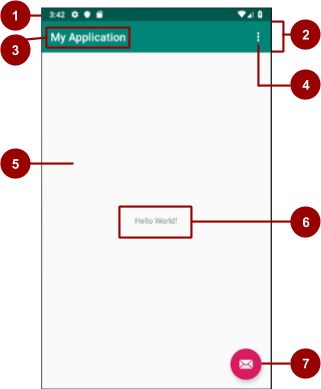

# 02_BasicActivity
    
## 1. Architecture of the Basic Activity template


|#|UI description|code reference|
|------|---|---|
|1|status bar. <br> 안드로이드 시스템이 제공하고 제어한다 |템플릿 코드에서는 보이지 않지만 activity에서 status bar를 access 할 수 있다. <br> 예를 들어 MainActivity.kt 에서 status bar를 hide 시키는 코드를 추가할 수 있다.|
|2|app bar. <br> action bar 라고 불리기도 한다 | activity_main.xml에서 AppBarLayout 요소 내에서 Toolbar를 확인할 수 있다. <br> 이전 버전과의 호환성을 위해 템플릿의 AppBarLayout에는 ActionBar와 동일한 기능을 가진 Toolbar가 있다 |
|3|app name. <br> 초기 값은 package name 이지만 변경할 수 있다 | AndroidMenifest.xml의 android:label="@string/app_name"을 참고. <br> app_name은 strings.xml에 정의되어 있다 |
|4|options-menu overflow button. <br> 액티비티에 대한 메뉴 항목이며 앱의 검색 및 설정과 같은 메뉴 옵션도 있다. | MainActivity.kt에서 onOptionsItemSelected() 메소드를 구현하면 된다. <br> basicActivity 템플릿에서는 res/menu/menu_main.xml을 이용하여 메뉴를 inflicate 시켰다.|
|5|CoordinatorLayout ViewGroup. <br> CoordinatorLayout은 강력한 FrameLayout으로서 애플리케이션에서 최상위 장식(decor)뷰로써 사용하거나 <br> 자식 뷰들간의 특정한 인터렉션을 위한 컨테이너로써 사용한다. | activity_main.xml 레이아웃에는 특정한 views 없이 content_main layout이 include 되어 있다.|
|6|TextView | "Hello World"라는 텍스트 뷰는 content_main.xml 내에 있다 |
|7|Floating action button(FAB) | FAB는 클립아트 아이콘을 사용하여 UI요소로 정의된다. <br> MainActivity.kt에서는 onCreate() 내에 FAB의 onClick() 리스너를 등록해놓았다. |


## 2. Customize the app that the template produces
#### 1. app_name 변경
    
```
    // res > values > strings.xml
    <string name="app_name">New Application</string>
```
    
#### 2. FAB (Floating Action Button) 색깔 변경
 - FAB는 colorAccent 속성의 값을 사용한다. FAB 색깔을 변경하려면 res > values > colors.xml 파일에서 colorAccent 속성의 값을 변경한다.
 - color를 선택하는데 도움을 받으려면 [Material Design color system](https://material.io/design/color/the-color-system.html#color-usage-palettes)을 참고

    
## 3. Add activities using template
 - Project > Android 창에서 java folder를 오른쪽 클릭한다
 - New > Activity > Gallery 선택
