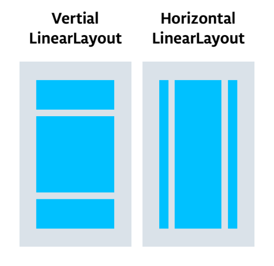
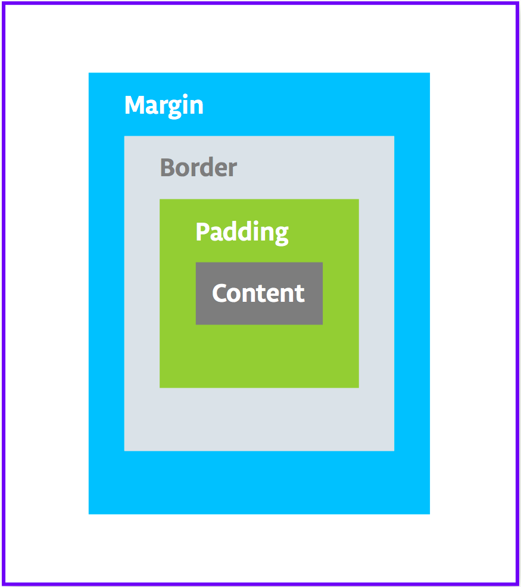

# 02-1. LinearLayout

## 1. View groups
 - ViewGroup이란 다른 뷰 또는 다른 view group을 child view로서 포함할 수 있는 뷰이다
 - 레이아웃을 구성하는 뷰는 view group을 루트로 하여 뷰의 계층 구조로 구성된다
 - LinearLayout view group에서 UI 요소는 가로 또는 세로로 배열된다.
 - LinearLayout, ScrollView는 view group이다.
 - LinearLayout은 child view들은 horizontally 또는 vertically로 정렬한다
 
 - ScrollView를 사용하면 이미지의 집합이나 화면에 긴 내용을 표현해야 할 경우 사용한다. ScrollView는 오로지 하나의 child view만 포함한다.
 - 하나 이상의 view를 scroll 하고 싶을 경우, LinearLayout과 같은 ViewGroup을 만들어 ScrollView 추가한다.
 
 

## 2. Style your TextView
#### 1. Padding versus Margin
 {: width="100" height="100"}
 
 - Padding은 뷰 또는 요소의 경계 내부 공간. 위의 그림과 같이 뷰의 가장자리와 뷰의 내용 사이의 공간이다.
 
 ```
 android:padding
 android:paddingTop
 android:paddingBottom
 android:paddingStart
 android:paddingEnd
 android:paddingLeft
 android:paddingRight
 ```
 
 - Margin은 뷰 경계의 바깥 공간. 뷰의 가장자리에서 부모 까지의 공간이다.
 
 ```
 android:layout_margin
 android:layout_marginBottom
 android:layout_marginStart
 android:layout_marginEnd
 android:layout_marginLeft
 android:layout_marginRight
 ```
 
 - app target이 API 레벨 17(Android 4.2)보다 높다면
    - 'right', 'left' 대신에 'start', 'end'를 사용해라
    - android:layout_marginLeft -> android:layout_marginStart
 - 안드로이드 4.2보다 낮은 버전에서 작업하거나 targetSdkVersion이나 minSdkVersion이 16보다 낮으면
    - 'right', 'left'와 'start', 'end'를 같이 사용해라
    - android:paddingLeft와 android:paddingStart를 둘다 사용

#### 2. Extract the style
 - style은 view의 포맷과 모양을 지정하는 속성의 모음이다.
 - style은 font color, font size, background color, padding, margin, 기타 일반적인 속성이 포함될 수 있다
 - 서식을 스타일로 추출하고 앱의 여러 view에서 스타일을 재사용 할 수도 있다
    - activity_main.xml의 Design 탭에서 Component Tree 안에 있는 TextView를 오른쪽 클릭한다. Refactor > Extract Style을 선택한다.
    - Extract Android Style 다이얼로그에서 layout_width와 layout_height, textAlighment의 체크박스를 해제한다.
    - style 역시 resource이므로 res/values/style.xml에 저장된다.
    
## 3. Add an ImageView
 - ImageView는 이미지 리소스를 나타내는 뷰이다.
 - ImageView는 Bitmap(PNG, JPG, GIF) 파일 또는 벡터 이미지와 같은 Drawable 리소스도 표현할 수 있다
 

## 4. Add ScrollView
 - ScrollView는 스크롤 할 수 있는 뷰 그룹이다.
 - scroll view는 하나의 다른 뷰, 또는 view group이 자식으로서 포함될 수 있다
 - child view는 주로 LinewLayout이며 LinewarLayout에는 다른 뷰들을 추가할 수 있다
 
 