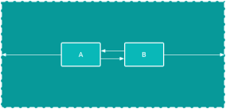

# 02-3_Constraint

## 1. ConstraintLayout
 - ConstraintLayout은 유연한 방식으로 하위 뷰를 배치하고 크기를 지정할 수 있는 ViewGroup이다
 - ConstraintLayout에서는 하나 이상의 수평 및 수직 제약 조건에 의해 뷰의 위치를 지정한다.


## 2. Adjust constraints
 - 사각형 안의 화살표는 constraint 제약 조건의 유형을 나타낸다
 
 
 
 - Wrap Content : 뷰가 컨텐츠에 맞게 필요한 만큼만 확장된다
 
 
 - Fixed: 뷰의 크기를 직접 조정할 수 있다.
 
 
 - Match Constraints: 뷰 마진을 제외 constarints 양쪽 측면까지 확장할 수 있다.
 
 
## 3. Chains
 - chain은 양방향 제약 조건으로 서로 연결된 뷰의 그룹이다
 - chain 내의 뷰들은 수평 또는 수직으로 나눠질 수 있다
 - 아래 다이어그램은 horizontal chain을 만든 제약 조건이다
 

 ### 1. Head of chain
  - chain 내의 첫번째 view를 chain의 head라고 한다.
  - chain의 head에 설정된 속성은 체인의 모든 뷰를 제어, 배치, 분배한다.
  - 수평 체인의 경우 헤드는 가장 왼쪽 뷰이며, 수직 체인의 경우 헤드는 가장 위쪽의 뷰이다.
  
  [!vertical_chain](./images/vertical_chain.png) [!horizontal_chain](./images/horizontal_chain.png)
 
 
 ### 2. Chain styles
  - 체인 스타일은 chain 된 뷰가 펼처지고 정렬되는 방식을 정의한다.
  - 체인 스타일 속성을 지정하거나 가중치를 추가하거나 뷰에 bias를 설정할 수 있다.
  - 체인 스타일에는 아래 방식이 있다.
    
    - **Spread**: default 스타일로 margin을 계싼한 후 사용 가능한 공간에 view들이 고르게 분산된다
    [!chainStyle_Spread](./images/chainStyle_spread.png)
    
    - **Spread Inside**: 첫번째 뷰와 마지막 뷰는 체인의 각 끝에서 부모에 연결되, 나머지 뷰들은 사용 가능한 공간에 골고루 분산된다
    [!ChainStyle_SpreadInside](./images/chainStyle_spreadInside.png)
    
    - **Packed**: margin이 계산된 후 뷰가 서로 함께 묶인다. 그 후 체인 헤드 뷰의 bias를 변경하여 전체 체인의 위치를 조정할 수 있다.
    [!ChainStyle_Packed](./images/chainStyle_PackedChain.png)
    [!ChainStyle_PackedChainWithBias](./images/chainStyle_PackedChainWithBias.png)
    
    - **Weighted**: layout_contstraintHorizontal_weight 또는 layout_constraintVertical_weight 속성에 설정된 값을 기반으로 모든 공간을 채우도록 뷰 크기가 조정된다. 아래 다이어그램에서 뷰 A는 가중치 1을, 뷰 B와 C는 각각 가중치 2를 사용한다
    [!ChainStyle_Weighted](./images/chainStyle_weighted.png)
    
  - chain style을 chain에 추가하려면 layout_constraintHorizontal_chainStyle 또는 layout_constraintVertical_chainStyle 속성을 체인의 헤드에 설정하면 된다.
  
  ```
    // Horizontal spread chain
    app:layout_constraintHorizontal_chainStyle="spread"
    
    // Vertical spread inside chain
    app:layout_constraintVertical_chainStyle="spread_inside"
    
    // Horizontal packed chain
    app:layout_constraintHorizontal_chainStyle="packed"
  ```