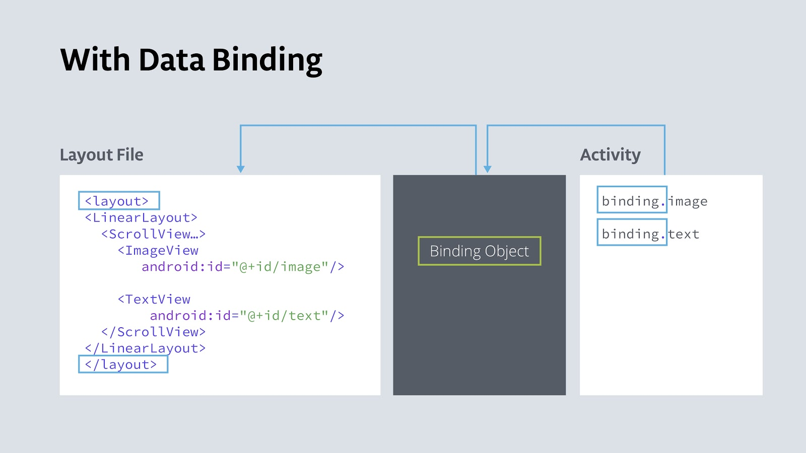

# 02-4 Data Binding

## 1. Data binding을 사용하여 findViewById() 제거
 - findViewById()를 사용하여 view가 create되고 recreate 된 이후에 리소스를 찾을 때 마다 안드로이드 시스템은 runtime 중에 뷰 계층 구조를 탐색한다.
 - 가벼운 앱이라면 상관 없겠지만 상용 앱에서는 레이아웃에 수십가지의 뷰가 있을 수도 있고, 많은 뷰가 중첩되어 있을 수도 있다
 - LinearLayout에 ScrollView가 포함되어 있고 그 ScrollView 안에 TextView가 포함되어 있다고 생각해보자. 규모가 크거나 깊은 뷰 계층 구조를 가지고 있으면 뷰를 찾는 데 시간이 오래 걸리고 사용자의 앱 속도가 눈에 띄게 느려질 수도 있다
 - 해결책은 각 뷰에 참조가 포함된 객체를 만드는 것이다. 이 객체는 Binding 객체라고도 부르며 전체 앱에서 사용할 수 있다.
 - 이 기술을 data binding이라고 하며, 앱에 대한 binding 객체가 생성되면 뷰 계층을 모두 다 훑거나 검색하지 않고도 바인딩 객체를 통해 뷰 및 다른 데이터에 엑세스 할 수 있다.
 
   
   
 - 데이터 바인딩의 이점은 다음과 같다
    - findViewById()를 사용하는 코드보다 코드가 짧고 읽기 쉽고 유지 관리하기 쉽다
    - 데이터와 뷰가 명확하게 분리된다.
    - 안드로이드 시스템은 뷰 계층 구조를 한번만 탐색하여 각 뷰를 가져오며 사용자가 앱과 상호작용 하는 runtime 때가 아닌 앱 시작 중에 발생한다
    - type safety를 얻을 수 있다. (type safety는 컴파일러가 컴파일 하는 동안 type의 유효성을 검사하고 변수에 잘못된 타입을 할당하려고 하면 오류를 발생시킨다.)
    
### 1. 데이터 바인딩 활성화
 - data binding을 사용하기 위해서는 Gradle 파일에 데이터 바인딩을 활성화 시켜야 된다.
 
 ```
    // build.gradle (Module: app)
    android {
    ...
    
        dataBinding {
            enabled = true
        }
    }
 ```

### 2. 데이터 바인딩을 사용할 수 있도록 layout 파일 변경
 - data binding을 사용하기 위해서는 XML 레이아웃 파일을 <layout>으로 감싸야 한다.
 - 루트 클래스는 더이상 ViewGroup이 아닌 view와 view group들을 포함하는 layout이 루트 클래스가 된다.
 - layout 태그로 감싸면 바인딩 객체가 레이아웃과 그 안에 있는 뷰에 대해 알 수 있다.

### 3. main activity에 binding 객체 생성
 
 #### 1. 액티비티에 binding 객체 참조 추가

 ```
    // MainActivity.kt
    
    private lateinit var binding: ActivityMainBinding
    
    override fun onCreate(savedInstanceState: Bundle?) {
    
    }
 ```
 
 #### 2. setContentView() -> DataBindingUtil.setContentView()
  - 현재 사용하고 있는 setContentView()를 다음을 수행하는 함수로 변경한다.
    - binding 객체를 생성한다
    - DataBindingUtil.setContentView()를 사용하여 activity_main 레이아웃과 MainActivity를 연결시킨다
  
  ```
    // MainActivity.kt
    import androidx.databinding.DataBindingUtil
    
    override fun onCreate(savedInstanceState: Bundle?) {
       // setContentView(R.layout.activity_main)
       binding = DataBindingUtil.setContentView(this, R.layout_activity_main)
    }    
  ```
  
### 4. findViewById()를 호출하는 모든 코드를 binding object를 사용하여 변경
 - binding 객체가 생성되면 컴파일러는 layout 내에 있는 뷰의 ID로부터 camel case binding 객체의 뷰 네임을 생성한다.로
 - 예를 들어 done_button은 doneButton, nickname_edit은 nicknameEdit이 된다.
 
 #### 1. findViewById() -> 바인딩 객체에서 button을 참조하는 코드로 변경한다.
    - findViewById<Button>(R.id.done_button) -> binding.doneButton
    
 ```
    // MainActivity.kt
     override fun onCreate(savedInstanceState: Bundle?) {
        super.onCreate(savedInstanceState)
        setContentView(R.layout.activity_main)
    
    //  findViewById<Button>(R.id.done_button).setOnClickListener {
    //      addNickname(it)
    //  }
    
        binding.doneButton.setOnClickListener{
            addNickname(it)
        }    
     }
 ```