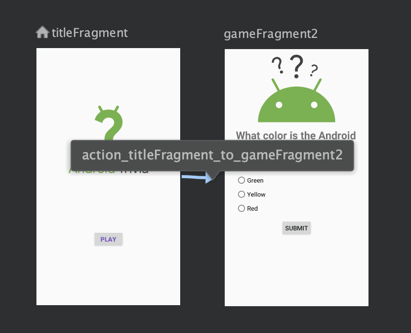
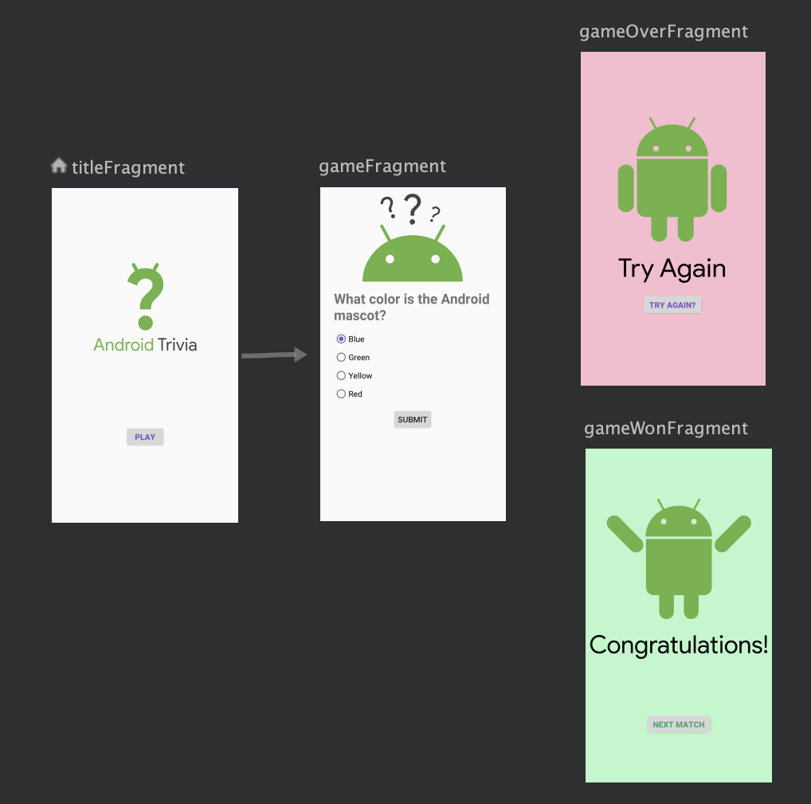
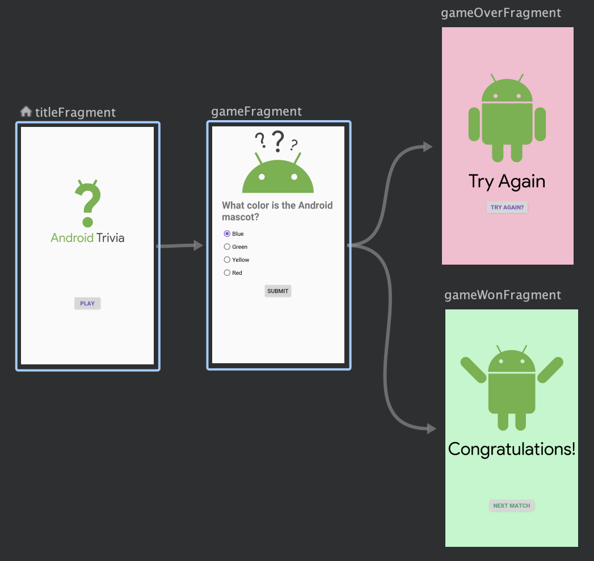
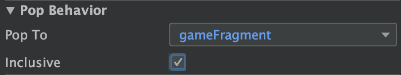
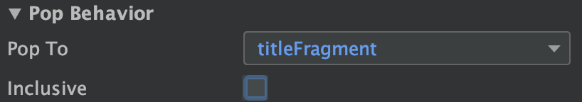

# 03-2 Navigation

## 1. Add navigation components to the project

### 1. Add navigation dependencies
 - navigation 라이브러리를 사용하기 위해 gradle file에 navigation 라이브러리를 추가한다
 
 ##### (1) project 레벨의 build.gradle 파일을 열어서 ext 변수와 함께 navigationVersion에 대한 변수를 추가한다
 
   - 최신의 navigation 버전을 알고 싶으면, [Declaring dependencies](https://developer.android.com/jetpack/androidx/releases/navigation#declaring_dependencies) 참고
   
    ext {
        ...
        navigationVersion = '1.0.0.-rc02'
        ...
    }
    
 ##### (2) app 레벨의 build.gradle 파일을 열어 navigation-fragment-ktx와 navigation-ui-ktx 라이브러리를 추가한다
  
    dependencies {
      ...
      implementation"android.arch.navigation:navigation-fragment-ktx:$navigationVersion"
      implementation "android.arch.navigation:navigation-ui-ktx:$navigationVersion"
      ...
    }
    
<br><br>

## 2. Add a navigation graph to the project
 - res 폴더에서 오른쪽 클릭 후 New > Android Resource File
 - New Resource File 다이얼로그에서 Resource type을 Navigation으로 선택한다
 - 생성하면 res > navigation 폴더 아래에 navigation.xml이 생성된다.
 - navigation.xml에서 Design 탭을 눌러 Navigation Editor를 열면 'No NavHostFragment found' 메세지가 나온다. 이는 다음 단계에서 해결할 수 있다.
 

<br><br>

## 3. Create the NavHostFragment
 - navigation host fragment는 navigation graph를 포함하는 host fragment 역할을 한다
 - 사용자가 navigation graph에 정의된 대상간에 이동하면 NavHostFragment는 필요에 따라 fragment를 교환한다.
 - NavHostFragment는 적절한 fragment back stack을 생성하고 관리한다
 
 - app:defaultNavHost 속성을 true로 설정하면 NavHostFragment가 default host가 되고 system Back Button을 가로챈다
 
 ```
    <fragment
        android:id="@+id/myNavHostFragment"
        android:name="androidx.navigation.fragment.NavHostFragment"
        android:layout_width="match_parent"
        android:layout_height="match_parent"
        app:navGraph="@navigation/navigation"
        app:defaultNavHost="true" />
 ```
 
<br><br>

## 4. Add fragment to the navigation graph
 ### Step 1: Add two fragments to the navigation graph and connect them with an action
  
  ##### 1) navigation.xml을 열어 navigation Editor에서 New Destination 버튼을 선택한다.
  
  ##### 2) 앱이 실행되자마자 TitleFragment를 사용자에게 보여주고 싶으므로 fragment_title을 처음으로 선택한다. 
  
  ##### 3) new destination 버튼을 눌러서 GameFragment도 추가한다
  
  ##### 4) preview 화면에서 title fragment의 pointer를 game fragment preview에 연결한다. 이 때 두 프래그먼트를 연결하는 action이 만들어진다.
  
   
   
 <br>
  
 ### Step 2: Add a click handler to the play button
 - title fragment와 game fragment가 action에 의해 연결되었다. Play 버튼을 눌렀을 때 game screen으로 사용자를 이동시키고 싶다.
 
 ##### 1) TitleFragment.kt의 onCreateView() 메소드에 return 문장 전에 아래 코드를 추가한다
 
 ```
   binding.playButton.setOnClickListner{}
 ```
 
 ##### 2) SetOnClickListener() 내부에서 바인딩 클래스를 통해 playButton에 액세스하고 game fragment로 이동하는 코드를 추가한다
 
 ```
   binding.playButton.setOnClickListner { view: View ->
        view.findNavController().navigate(R.id.action_titleFragment_to_gameFragment)
   }
 ```

<br><br>

## 5. Add conditional navigation
 - 특정 조건에 따라 화면에 다르게 보이는 navigation도 만들 수 있다.
 - conditinal navigation의 일반적인 사용 사례는 사용자의 로그인 여부에 따라 앱의 흐름이 다른 경우이다.
 - 이번 예쩨에서는 사용자가 모든 질문에 올바르게 대답했는지에 따라 fragment를 분기시킨다.
    - GameWonFragment는 스크린에 "Congratulations!" 메세지를 나타낸다
    - GameOverFramgnet는 스크린에 "Try Again!" 메세지를 나타낸다.
 
 ### Step 1: Add GameWonFragment and GameOverFragment to the navigation graph
 
  - navigation.xml 파일을 열고 New Destination 버튼을 클릭한 후 fragment_game_over와 fragment_game_won 을 추가한다

 
 
 <br>
 
 ### Step 2: Connect the game fragment to the game-result fragment
 
 - Layout Editor의 preview 영역에서 GameFragment를 GameOverFragment와 GameWonFragment에 각각 연결시킨다.
 
  
 

  <br>
 
 ### Step 3: Add code to navigate from one fragment to the next
 
 - GameFragment.kt의 onCreateView()에 조건에 따라 navigate 하는 함수를 추가한다
 
 ```
    override fun onCreateView(
        inflater: LayoutInflater, container: ViewGroup?,
        savedInstanceState: Bundle?
    ): View? {
            ...
            
            if(answers[answerIndex] == currentQuestion.answers[0]) {
                questionIndex++
                
                // Advance to the next question
                if(questionIndex < numQuestions) {
                      
                } else {
                    // GameWonFragment
                    view.findNavController().navigate(R.id.action_gameFragment_to_gameWonFragment)
                }
            } else {
                // GameOverFragment
                view.findNavController().navigate(R.id.action_gameFragment_to_gameOverFragment)
            }
        }

        return binding.root
    }
 ```

<br><br>

## 6. Change the Back button's destination
 - 안드로이드 시스템은 사용자의 화면 이동을 추적한다
 - 사용자가 새로운 destination에 도달할 때 마다 Android는 해당 destination을 back stack에 추가한다
 - 사용자가 back 버튼을 누르면 백 스택의 맨 위에 있는 대상으로 이동한다
 - 보통 기본적으로 백 스택의 상단은 사용자가 마지막으로 본 화면이다
 - 하지만 현재 예제 앱에서는 GameOverFragment나 GameWonFragment 화면에서 백 버튼을 눌렀을 경우 GameFragment로 이동하는데, 더 나은 동작을 위해서는 GameFragment가 아닌 TitleFragment로 이동해야 한다.
 
 ### Step 1: Set the pop behavior for the navigation actions
 - 사용자가 GameWon 또는 GameOver 화면에 있을 때 백 버튼을 누르면 타이틀 화면으로 돌아가도록 back stack을 관리해야된다.
 - 프래그먼트를 연결하는 액션에 대해 'pop' 동작을 설정하여 back stack을 관리한다
    
    - **popUpTo** : navigating 전에 지정된 destination으로 백 스택을 "pops up"한다
    - **popUpToInclusive = false** : popUpToInclusive 속성이 false 이거나 설정되지 않으면 popUpTo는 지정된 destination까지 모든 destination을 지운다. 그러나 지정된 destination은 백 스택에 남겨둔다
    - **popUpToInclusive = true** : popUpToInclusive 속성이 true이면 popUpTo 속성은 백스택에 주어진 destination까지 포함하여 지운다
    - popUpToInclusive가 true이고 popUpTo가 앱의 시작 화면으로 설정된 경우에는 앱의 백스택에 있는 모든 destination을 지우므로, 백 버튼은 사용자를 앱에서 완전히 빠져 나오게 한다.
 
 - 레이아웃 편집기에서 속성들 중 **Pop To** 필드를 사용하여 PopUpTo 속성을 설정할 수 있다
    
    ##### 1) navigation.xml에서 gameFragment와 gameOverFragment를 연결하는 action을 선택한다.
    ##### 2) Attributes 창에서 **Pop To**를 gameFragment로 설정하고, **inclusive** 체크박스를 선택한다.
 
    
        
      
    
    - 이 속성은 navigation component에 백 스택에서 GameFragment를 포함한 fragment를 제거하도록 지시한다.
    - 이 동작은 **Pop To** 필드에 titleFragment를 설정하고 **Inclusive** 체크박스를 해제하는 것과 같다
    
    
    ##### 3) gameFragment와 gameWonFragment를 연결하는 action을 선택한다
    ##### 4) **Pop To**에 gameFragment를 설정하고 **inclusive** 체크박스를 선택한다.
 
 <br>
 
 ### Step 2: Add more navigation actions and add onClick handlers
  - 사용자가 **Next Match** 또는 **Try Again** 버튼을 눌렀을 경우 GameFragment 화면으로 연결시킨다.
  - 이동한 GameFragment 화면에서는 백 버튼 선택 시 GameWon이나 GameOver 화면이 아닌 TitleFragment 화면으로 이동해야 한다.
  
    ##### 1) navigation.xml에서 gameOverFragment에서 gameFragment로 연결하는 action을 추가한다.
    ##### 2) Attributes 창에서 Pop To 속성을 titleFragment로 설정하고, Inclusive 체크를 해제한다. (titleFragment 까지의 모든 것을 백스택에서 제거한다)
  
    
  
    ##### 3) navigation.xml에서 gameWonFragment와 gameFragment를 연결하는 action을 추가한다.
    ##### 4) 2)번의 작업을 반복한다.
    
  - **Try Again** 과 **Next Match** 버튼을 눌렀을 때 GameFragment로 이동하는 기능을 추가한다
  
    ##### 1) GameOverFragment.kt 파일에서 onCreateView() 메소드 끝에 return문 직전에 아래 코드를 추가한다.
  
  
     ```
     // Add onClick Handler for Try Again button
        binding.tryAgainButton.setOnClickListner { view: View -> 
                view.findNavController()
                    .naigate(R.id.action_gameOverFragment_to_gameFragment) }
     ```
     
     
    ##### 2) GameWonFragment.kt 파일을 열어서  onCreateView() 메소드 끝에 return문장 전에 아래 코드를 추가한다
    
    ```
    // Add OnClick Handler for Next Match button
            binding.nextMatchButton.setOnClickListener{view: View->
                view.findNavController()
                        .navigate(R.id.action_gameWonFragment_to_gameFragment)}
                        
    ```
    
    ##### 3) 앱을 실행시키면 Next Match와 Try Again 버튼을 눌렀을 때 game을 다시 할 수 있는 game screen으로 이동하는 것을 확인할 수 있다
    ##### 4) Next Match와 Try Again 버튼을 누른 후 시스템 백 버튼을 누르면, 이전 화면이 아닌 titleFragment로 이동하는 것을 확인할 수 있다.
    
  
    
  