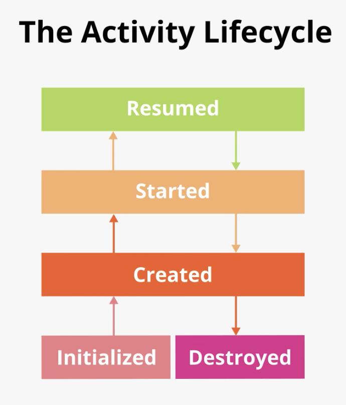
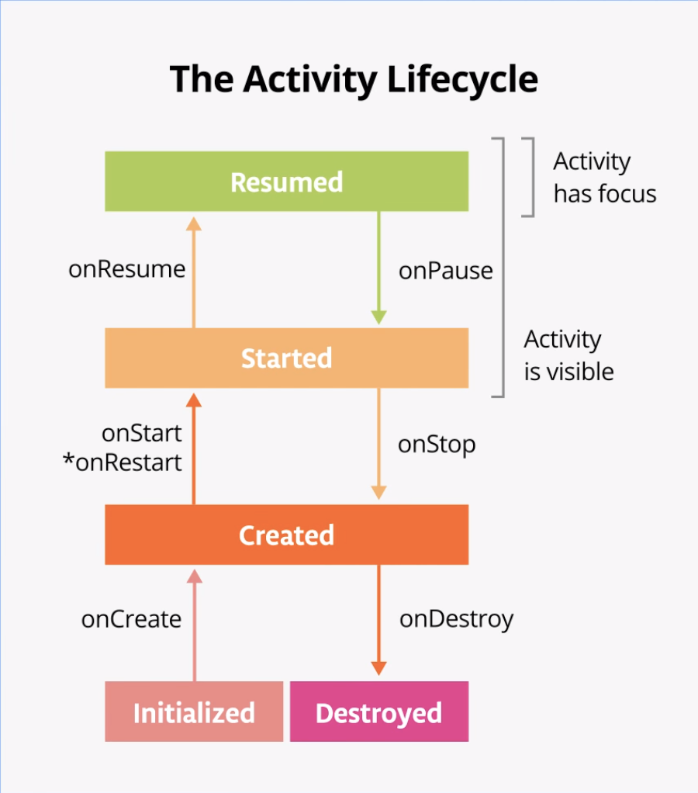
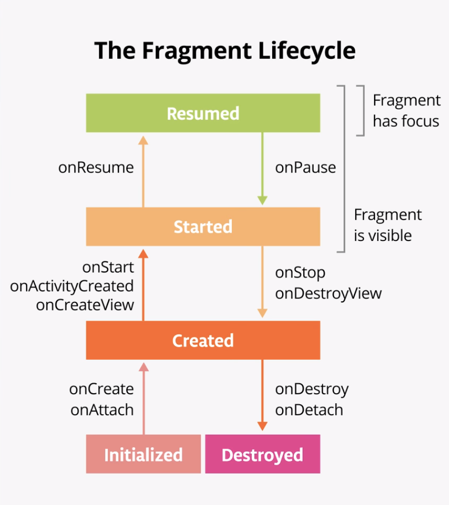

# 04-1_Lifecycles and Logging

## 1. Explore the lifecycle methods and add basic logging
 - 모든 액티비티와 프래그먼트는 lifecycle을 가지고 있다
 - activity 라이프 사이클은 activity가 처음 초기화 된 시점부터 마지막으로 destroy 되고 시스템 메모리 상에서 회수될 때 까지 여러 상태로 구성된다. 
 - 사용자가 앱을 시작하고 액티비티 간 또는 앱의 내부 및 외부를 이동하면서, 그리고 앱을 떠나면서 activity의 상태는 변한다
 
 
 
 - 안드로이드는 ativity가 다른 상태로 변할 때 마다 callback을 invoke한다.
 - lifecycle의 변경될 때 수행되어야 할 작업으로 method를 오버라이드 할 수 있다.
 - 아래 다이어그램은 오버라이드 가능한 메소드와 lifecycle을 함께 보여준다.
 
  
  
 <br> 
  
 - 프래그먼트 역시 lifecycle을 가지고 있다. 프래그먼트의 라아프사이클은 액티비티의 라이프사이클과 많이 유사하다. 프래그먼트 라이프사이클은 아래 그림과 같다
 
 

<br>
 
 ### Step 1: Examine the onCreate()
  - 안드로이드 logging API를 사용하여 안드로이드 생명주기에 대해 더 파악해보자
  
  ```
      override fun onCreate(savedInstanceState: Bundle?) {
      ...
      }
  ```
  
  - onCreate() 메소드는 액티비티에서 일회성의 초기화가 이루어져아 한다. 예를 들어 onCreate()에서 layout을 inflate 시키고, click listener와 data binding을 정의할 수 있다
  
  <br>
  
  ### Step 2: Implement the onStart()
   - onStart()는 onCreate()가 호출된 직후 불린다. onStart()가 실행되면 activity가 screen에 나타난다
   - onCreate()는 액티비티를 초기화하기 위해 한번만 호출되지만 onStart()는 여러번 호출될 수 있다.
   - onStart()는 onStop()과 쌍을 이루는데, 사용자가 앱을 시작한 다음 기기의 홈 화면으로 돌아가면 activity가 중지되고 더 이상 화면에 표시되지 않는다.
   
   ##### 1. 안드로이드 스튜디오에서 MainActivity.kt를 열고 ctrl+o를 눌러 오버라이드 할 수 있는 메소드들의 리스트를 살펴본다
   
   ```
   override fun onStart() {
      super.onStart()
   }
   ```
   
   ##### 2. compile 후 앱을 실행시키고 로그를 살펴본다
   
   - onCreate()와 onStart() 메소드가 차례로 호출되고 activity가 화면에 표시된다
   - 홈 버튼을 눌러서 나갔다가 다시 activity로 들어오면 activity가 중단된 곳에서 다시 시작된다. onStart()는 Logcat에 2번 찍히지만 onCreate()는 다시 호출되지 않는 것을 볼 수 있다.
   
   ```
   I/MainActivity: onCreate Called
   I/MainActivity: onStart Called
   I/MainActivity: onStart Called
   I/MainActivity: onStart Called
   I/MainActivity: onStart Called
   ```

<br><br>

## 2. Use Timeber for logging
 - **Timber**는 유명한 로깅 라이브러리이다
 - Timber는 안드로이드 내장 Log 클래스와 비교하여 몇가지 장점이 있다
    
   - 클래스 이름으로 로그 태그를 생성한다
   - 앱의 릴리즈 버전에서는 로그를 표시하지 않도록 도와준다
   - crash-reporting 라이브러리와 통합할 수 있다
   
   
 ### Step 1: Add Timber to Gradle
  - [Timber project - github](https://github.com/JakeWharton/timber#download)의 README.md 내용 중 Download에서 버전 정보를 참고한다
  
  
  ```
    implementation 'com.jakewharton.timber:timber:4.7.1'
  ```
  
  - build.gradle(Module:app)을 열어서 dependencies 영역에 추가한다.
  
 <br>
 
 ### Step 2: Create an Application class and initialize Timber
  - 이번 단계에서는 Application을 만든다. Application은 global 어플리케이션의 상태를 포함하는 기본 클래스이다
  - 또한 운영 체제가 앱과 상호 작용하기 위해 사용하는 주요 객체이다
  - 따로 지정하지 않으면 Android에서 사용하는 기본 Application 클래스가 제공되므로 앱을 만들기 위해 특별한 작업을 수행할 필요 없이 항상 앱에 대해 생성된 Application 객체가 있다
  - 전체 앱에서 이 로깅 라이브러리를 사용하고 다른 모든 것이 설정되기 전에 라이브러리를 한번 초기화해야 하므로 Timber는 Application 클래스를 사용한다
  - (액티비티 코드는 Application 클래스에 넣지 않는다.)
  
  - Application 클래스를 만들고 나면 Android manifest에 클래스를 지정해야 된다
    
    ##### 1. ClickerApplication 이라는 새로운 클래스를 만든다.
    
        ```
         package com.example.android.lifecycles
         
         class ClickerApplication {
         }
         
        ```
    
    ##### 2. ClickerApplication을 Application의 하위 클래스로 변경한다
    
        ```
         class ClickerApplication : Application() {
         
         }
        ```
    
    ##### 3. onCreate() 메소드를 오버라이드 한다
    
        ```
         class ClickerApplication : Application() {
            
            override fun onCreate() {
                super.onCreate()
            }
         }
        ```
    
    ##### 4. onCreate() 메소드 안에서 Timber 라이브러리를 초기화한다.
     - Timber 라이브러리를 Application에서 초기화하면 activity에서 Timber 라이브러리를 사용할 수 있다
     
        ```
        class ClickerApplication : Application() {
        
            override fun onCreate() {
                super.onCreate()
        
                Timber.plant(Timber.DebugTree())
            }
        }
        ```
    
    ##### 5. AndroidManifest.xml을 열어서 \<application\> 요소에 ClickerApplication 클래스를 추가한다.
        ```
        <application
           android:name=".ClickerApplication"
        ...
        ```
 
 <br>
    
 ### Step 3: Add Timber log statements
  - Log.i() 대신에 Timber 라이브러리를 사용하도록 변경한다.
  
    ##### 1. MainActivity의 onCreate() 메소드에서 Log.i()를 Timber.i()로 변경한다.
      - Timber는 log tag가 필요하지 않고, 클래스의 이름을 자동으로 tag로 처리한다. 
      
        ```
        Timber.i("onCreate called")
        ```
    
    ##### 2. onStart()의 Log도 변경한다.
    
    ##### 3. 남아있는 다른 lifecycle 메소드로 오버라이드 하여 Timber 로그를 추가한다.
    
    ```
       override fun onResume() {
          super.onResume()
          Timber.i("onResume Called")
       }
       
       override fun onPause() {
          super.onPause()
          Timber.i("onPause Called")
       }
       
       override fun onStop() {
          super.onStop()
          Timber.i("onStop Called")
       }
       
       override fun onDestroy() {
          super.onDestroy()
          Timber.i("onDestroy Called")
       }
       
       override fun onRestart() {
          super.onRestart()
          Timber.i("onRestart Called")
       } 
    ```
  
  <br>
  
  - 액티비티가 시작되면 다음 세가지 라이프 사이클 콜백이 호출된 것을 볼 수 있다
    - onCreate(): to create the app
    - onStart(): to start it and make it visible on the screen.
    - onResume(): to give the activity focus and make it ready for the user to interact with it.

<br><br>

## 3. Explore lifecycle use cases
 ### Use case 1: Opening and closing the activity
  - 앱을 처음 시작한 다음 완전히 종료한다
  
  ##### 1. 앱을 처음 실행될 때 onCreate(), onStart(), onResume() 콜백이 호출된다.
  
  ##### 2. 컵케이크를 몇번 탭한다.
  
  ##### 3. 백 버튼을 누르면 onPause(), onStop(), onDestroy()가 차례로 호출된다.
   - 이 경우 백 버튼을 사용하면 activity(앱)이 완전히 종료된다.
   - onDestroy() 메소드는 activity가 완전히 종료될 수 있으 가비지 컬렉터에 의해 수집될 수 있음을 의미한다
   - 액티비티는 코드에서 finish()를 호출하거나 사용자가 앱을 끌 경우 완전히 종료된다.
   - 또한 앱이 오랫동안 화면에 표시되지 않을 경우 android 시스템에서 activity를 자체적으로 종료할 수도 있다. 안드로이드에서는 배터리를 보호하고 다른 앱에서 앱 리소스를 사용할 수 있도록 이 작업을 수행한다.
   
  ##### 4. 다시 앱으로 돌아가면 다음과 같은 logcat을 볼 수 있다
  
   - activity가 다시 create 되면서 Desserts Sold 숫자도 0으로 초기화 되었다.
   
  ```
  2019-12-17 17:52:50.323 3256-3256/com.example.android.lifecycles I/MainActivity: onPause Called
  2019-12-17 17:52:51.243 3256-3256/com.example.android.lifecycles I/MainActivity: onStop Called
  2019-12-17 17:52:51.263 3256-3256/com.example.android.lifecycles I/MainActivity: onDestroy Called
  
  2019-12-17 17:52:54.964 3256-3256/com.example.android.lifecycles I/MainActivity: onCreate called
  2019-12-17 17:52:55.027 3256-3256/com.example.android.lifecycles I/MainActivity: onStart Called
  2019-12-17 17:52:55.029 3256-3256/com.example.android.lifecycles I/MainActivity: onResume Called
  
  ```
  
  - 이전 단계에서 액티비티가 destroy 되었다. 앱으로 다시 돌아오면 안드로이드는 새로운 activity를 시작하고 onCreate(), onStart(), onResume() 메소드를 호출한다
  - 중요한 포인트는 하나의 액티비티 인스턴스의 lifetime 주기에서 onCreate()와 onDestroy()는 한번만 호출된다는 것이다
  - onCreate()는 초기에 앱을 초기화 시키기 위해 사용되며 onDestroy()는 앱에서 사용하는 리소스를 정리하기 위해 사용된다
  - onCreate()에서 변수를 초기화하거나 inflate 함으로써 레이아웃을 설정한다. 
 
 
<br><br>

 ### Use case 2: Navigating away from and back to the activity
  - 사용자가 안드로이드 기기와 상호작용 함에 따라 앱 간 전환하거나 홈으로 돌아오거나 새로운 앱을 시작하고, 전화 통화와 같은 다른 액티비티로 인한 인터럽트도 처리해야 한다.
  - 사용자가 activity에서 벗어날 때마다 액티비티가 매번 완전히 종료되지는 않는다
    - 액티비티가 화면에 더이상 표시되지 않으면 액티비티를 background에 놓는다 (이와 반대되는 경우는 액티비티가 foreground 또는 화면에 있을 경우이다)
    - 사용자가 앱으로 돌아오면 동일한 activity가 restart 되고 다시 보여지는데 수명주기의 이 부분을 앱의 visible lifecycle이라고 부른다
    
  - 앱이 백그라운드에 있을 경우 시스템 리소스와 배터리 수명 보존을 위해 앱이 실행되고 있으면 안된다
  - 액티비티의 생명주기 및 해당 콜백을 사용하여 앱이 백그라운드에 언제 들어가는 지 알고 진행 중인 작업을 일시 중지 할 수 있다
  - 앱이 foreground로 나오면 작업을 다시 시작한다
  
  - 이번 단계에서는 앱이 백그라운드에서 포그라운드로 이동할 때의 lifecycle을 살펴본다
  
  <br>
  
  ##### 1. 앱을 실행시키고, 컵케이크를 몇번 누른다
  
  <br>
  
  ##### 2. 홈 버튼을 누르고 홈 화면으로 돌아가면 앱을 완전히 종료하지 않고 백그라운드에 둔다. onPause(), onStop() 메소드는 호출되지만 onDestroy() 메소드는 호출되지 않는다
   - onPause()가 호출되면 앱은 더이상 focus를 가지고 있지 않는다
   - onStop() 후에는 앱이 더이상 화면에 표시되지 않는다
   - activity가 중지 되었지만 activity 객체는 아직 백그라운드, 메모리 상에 존재한다
   - 액티비티는 destory 되지 않았다. 
   - 사용자가 다시 앱으로 돌아올 수 있으므로 안드로이드는 activity의 리소스를 유지한다.
  
  <br>
  
  ##### 3. 다시 앱으로 돌아오면 logcat에서 onRestart(), onStart(), onResume()이 호출된 것을 확인할 수 있다
   - 액티비티가 foreground로 돌아와도 onCreate() 메소드는 다시 호출되지 않는다
   - onCreate() 대신 onRestart()이 호출된다
   - activity가 foreground로 나오면서 Desserts Sold 숫자도 유지된다
   
   
   ```
   2019-12-17 18:24:33.020 3256-3256/com.example.android.lifecycles I/MainActivity: onPause Called
   2019-12-17 18:24:33.098 3256-3256/com.example.android.lifecycles I/MainActivity: onStop Called
   
   2019-12-17 18:24:37.791 3256-3256/com.example.android.lifecycles I/MainActivity: onRestart Called
   2019-12-17 18:24:37.792 3256-3256/com.example.android.lifecycles I/MainActivity: onStart Called
   2019-12-17 18:24:37.804 3256-3256/com.example.android.lifecycles I/MainActivity: onResume Called
   ```
   
   - onPause()와 onStop()은 앱이 background로 들어갈 때 호출되고, onRestart()와 onStart(), onResume()은 앱이 foreground로 나올 때 호출된다
   
   - 중요한 점은 사용자가 액티비티를 이동할 때 onStart(), onStop()이 여러번 호출된다는 점이다


<br><br>

 ### Use case 3: Partially hide the activity
  - onStart()가 호출되면 앱이 스크린에서 보여지고(visible), onResume()이 호출되면 앱은 user focus를 얻는다.
  - 앱이 온전히 screen 위에 있고 user focus를 가지고 있으면 이 떄의 lifecycle을 interactive lifecycle이라고 한다
  - 앱이 백그라운드로 이동하면 onPause() 후에 포커스가 사라지고 onStop() 후에는 화면에 더이상 앱이 표시되지 않는다
  - 앱이 user focus 없이도 스크린에 부분적으로 보여지는 것이 가능하므로 focus와 visibility의 차이를 아는 것은 중요하다

  <br>
  
  ##### 1. 앱을 실행시키고, 오른쪽 상단이 share 아이콘을 클릭한다
   - sharing activity가 화면의 절반에 나타나지만 케이크 activity는 여전히 위쪽 절반에 표시되고 있다
   
  <br>
  
  ##### 2. logcat에서 onPause()만 호출된 것을 확인할 수 있다
   - 액티비티가 부분적으로 보여지고 있기 때문에 onStop()은 호출되지 않았다. 
   - 그러나 user focus는 없으므로 사용자와 interact 할 수는 없다.
   - onPause() 코드를 가볍게 유지하는 것이 중요하디. 예를 들어 onPause()가 무거우면 걸려오는 전화 알림을 지연시킬 수도 있다
  
  <br>
  
  ##### 3. sharing 다이얼로그를 나오면 onResume()이 호출되는 것을 확인할 수 있다
   - onResume()과 onPause()는 모두 focus와 관계가 있다
   - onResume()은 액티비티가 focus를 얻을 때 호출되고 onPause()는 액티비티가 포커스를 잃을 때 호출된다
   
<br><br>

## 3. Explore the fragment lifecycle
 - onAttach(): fragment과 activity와 연관될 때 호출된다
 - onCreate(): activity의 onCreate()와 유사하게 fragment의 onCreate()는 fragment 생성자를 초기화하게 위해 사용된다(레이아웃 제외)
 - onCreateView(): fragment layou이 inflate 될 때 호출된다
 - onActivityCreated(): 액티비티의 onCreate()가 완료될 때 호출된다. 프래그먼트는 이 메소드가 호출될 때 까지 activity에 접근할 수 없다
 - onStart(): 프래그먼트가 visible 될 때 호출된다 (activity의 onStart()와 병행)
 - onResume(): 프래그먼트가 focus를 얻을 때 호출된다(activity의 onResume()과 병행)
 
 - onPause(): 프래그먼트가 focus를 잃을 때 호출된다(activity onPause()와 동시에)
 - onStop(): 프래그먼트가 더이상 화면에서 보이지 않을 때 호출된다(activity의 onStop()와 동시에)
 - onDestroyView(): 프래그먼트 뷰가 더이상 필요하지 않을 때 호출된다. 뷰와 관련된 리소를 정리하기 위해 호출한다.
 
 <br>
 
 - fragment가 이미 존재하고 activity에 이미 attach 되어 있으면 프래그먼트를 나갔다 들어와도 onAttach()와 onCreate()는 호출되지 않을 수 있다. 이럴 경우 onCreateView()가 호출된다
 - activity와 동일하게 홈버튼을 눌러 나가면 onPause()와 onStop()이 호출되고, 다시 되돌아오면 onStart()와 onResume()이 호출된다
   
   