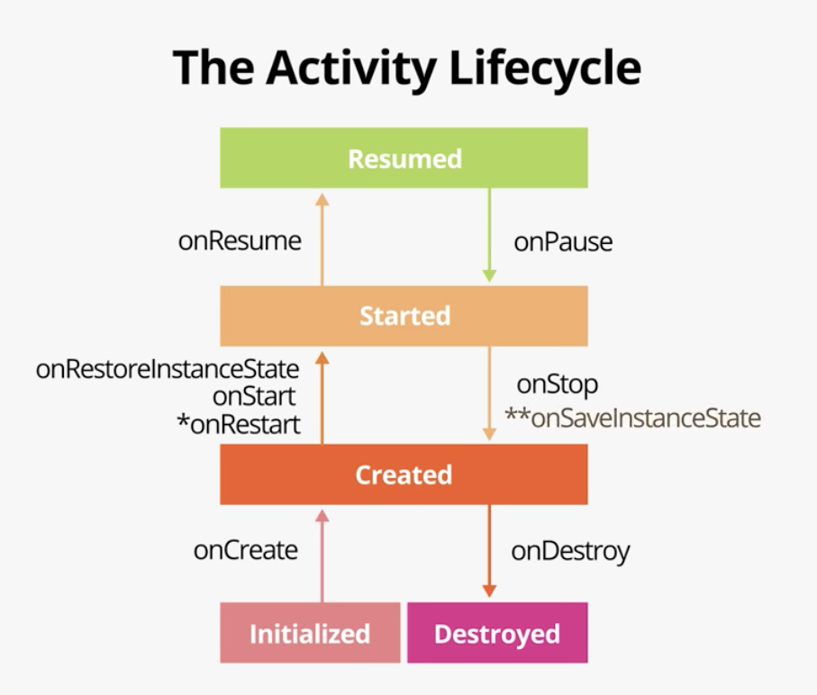

# 04-2_Complex_Lifecycle

## 1. lifecycle library
 - android jetpack의 일부로, 액티비티나 프래그먼트의 상태에 따라 처리되는 코드를 쉽게 관리할 수 있게 도와주는 라이브러리이다.
 - lifecycle을 사용하면 기존 코드를 더 읽기 쉽고 관리하기 쉬운 코드로 만들 수 있다
 - 이 라이브러리는 수명주기 작동 방식을 뒤집는다. 
    - 보통은 액티비티나 프래그먼트는 lifecycle 콜백이 발생할 때 수행할 작업을 컴포넌트(ex.DessertTimer)에게 알려준다
    - 하지만 lifecycle library를 사용하면 컴포넌트 스스로 lifecycle의 변화를 감지한 다음, 이런 변화가 발생할 때 필요한 작업을 수행한다
 
 - lifecycle library의 세가지 주요 부분이 있다
    - **Lifecycle owner**는 lifecycle을 가지고 있는 Activity나 Fragment를 의미한다. Lifecycle owner는 LifecycleOwner 인터페이스를 구현한다
    - **Lifecycle** 클래스는 lifecycle owner의 실제 상태를 유지하고 lifecycle 변경이 발생할 때 이벤트를 트리거한다
    - **Lifecycle Observer**는 라이프사이클의 상태를 관찰하고 라이프사이클이 변할 때 작업을 수행한다. Lifecycle observer는 LifecycleObserver 인터페이스를 구현한다

<br>    
    
### Step 1: Turn DessertTimer into a LifecycleObserver
 - lifecycle 라이브러리의 핵심 부분은 lifecycle observation 개념이다
 - Observation은 클래스(DessertTimer와 같은)가 activity나 fragment의 lifecycle에 대해 알고, lifecycle의 변화에 따라 스스로 start 하고 stop 할 수 있게 해준다
 - lifecycle observer를 사용하면 activity와 fragment의 method에서 object를 start와 stop시키는 기능을 제거할 수 있다
 
 <br>
   
 ##### 1) DessertTimer.kt 클래스를 열어서 클래스 선언을 아래와 같이 변경한다
  - 생성자는 Lifecycle 객체를 받아서 사용한다. Lifecycle 객체는 timer가 관찰하는 수명주기이다
  - 클래스는 LifecycleObserver 인터페이스를 구현한다
  
 ```
 class DessertTimer(lifecycle: Lifecycle) : LifecycleObserver {
 
 }
 ```
 
 <br>
 
 ##### 2) runnable 변수 아래에 init 블럭을 추가한다. init 블럭에서 addObserver() 메소드를 사용하여 owner(activity)에서 observer(클래스)로 전달된 lifecycle 오브젝트를 연결한다
 
 ```
 init {
    lifecycle.addObserver(this)
 }
 ```
 
 <br>
 
 ##### 3) startTimer()에 @OnLifecycleEvent(Lifecycle.Event.ON_START) 어노테이션을 추가한다
 
 ```
  @OnLifecycleEvent(Lifecycle.Event.ON_START)
  fun startTimer() {
 ```
 
 <br>
 
 ##### 4) stopTimer()에도 어노테이션을 추가한다
 
 ```
  @OnLifecycleEvent(Lifecycle.Event.ON_STOP)
  fun stopTimer()
 ```
 
 <br>
 
 ### Step 2: Modify MainActivity
  - MainActivity는 이미 상속을 통해 lifecycle owner이다. AppCompatActivity가 상속하는 FragmentActivity가 LifecycleOwner를 implements 했기 때문이다.
  - 그러므로 activity 라이프 사이클을 인식하기 위해 따로 할 작업은 없다
  - 변경해야 할 부분은 activity의 lifecycle 객체를 DessertTimer 생성자로 전달하기만 하면 된다.
  
 <br>
 
 ##### 1) MainActivity.kt의 onCreate()에서 DessertTimer 생성자 호출 부분을 아래와 같이 변경한다
 
 ```
    dessertTimer = DessertTimer(this.lifecycle)
 ```
 
 - lifecycle 프로퍼티는 액티비티가 소유한 Lifecycle 오브젝트를 가지고 있다
 
 <br>
 
 ##### 2) onCreate()에서 startTimer() 호출 부분과 onStop()에서 stopTimer() 호출 부분을 제거한다
  - 더이상 DessertTimer에게 activity lifecycle에서 수행할 작업을 지시할 필요가 없다. 
  - DessertTimer가 lifecycle을 스스로 observe하고 lifecycle이 변경될 때 자동으로 알아채기 때문이다

<br><br>

## 2. Simulate app shutdown and use onSaveInstanceState()
 - 앱이 background로 들어가면 destroy 되는게 아니라 단지 stop되어 사용자가 돌아오기를 기다린다
 - 그러나 안드로이드 OS의 주요 관심사 중 하나는 foreground에 있는 activity가 smooth하게 돌아가는 것이므로 안드로이드는 포그라운드 앱의 동작이 문제 없도록 백그라운드 앱을 조정한다. 예를 들어 안드로이드는 백그라운드에서 실행되는 앱의 처리량을 제한한다
 - 때때로 안드로이드는 앱과 관련된 모든 activity를 포함한 app 프로세스를 종료하기도 한다. 시스템이 부하를 받을 경우 안드로이드는 이런 종류의 shutdown을 실행하는데 이 시점에서 추가 콜백이나 코드가 실행되지 않는다. 
 - 앱의 프로세스가 백그라운드에서 자동으로 종료되더라도 사용자는 앱이 닫힌 것처럼 보이지 않으며 사용자가 안드로이드 OS가 종료한 앱으로 다시 이동할 경우 안드로이드는 해당 앱은 restart한다
 
 <br>
  
 ### Step 1: Use adb to simulate a process shutdown
 - ADB(android debug bridge)는 컴퓨터에 연결된 애뮬레이터 장치 및 디바이스에 명령을 보낼 수 있는 command-line 도구이다
 - 이 단계에서 adb를 사용햐여 앱 프로세스를 닫고 안드로이드가 앱을 종료할 때 발생하는 상황을 확인한다
 
 ##### 1) 앱을 실행시키고 컵 케이크 아이콘을 몇번 클릭한다
 
 ##### 2) 홈 버튼을 눌러 앱을 백그라운드로 보낸다. 이제 앱이 stop 되었으며 안드로이드에서 리소스가 필요할 경우 앱이 종료될 수 있다
 
 ##### 3) 안드로이드 스튜디오에서 터미널 탭을 눌러 adb 명령어를 실행한다
 
 ```
 adb shell am kill com.example.android.lifecycles
 ```
 
 - 이 커맨드는 앱이 백그라운드에 있을 때만 안드로이드 애뮬레이터나 디바이스에게 lifecycles을 패키지 이름으로 하는 프로세스를 중단하라는 명령이다.
 - 안드로이드 스튜디오에서 Run 탭을 클릭하면 "Application terminated."라는 메세지를 확인할 수 있고, logcat 탭에서는 onDestroy() 콜백 호출 없이 앱이 종료된 것을 확인할 수 있다
 
 <br>
 
 ##### 4) recents screen을 사용하여 앱으로 돌아온다. 앱이 백그라운드에 있었든지 완전히 종료되었든지 관계 없이 앱이 실행된다. 
  - recent screen을 사용하여 앱으로 돌아가면 액티비티가 다시 시작되고 activity는 onCreate()을 시작으로 전체 lifecycle 콜백이 시작된다
 
 ##### 5) score는 다시 '0'으로 초기화 되어 있다
 
 
 - 안드로이드에서는 액티비티에서 벗어날 때 마다 일부 뷰의 상태 값을 가져와서 bundle에 저장한다
 - 자동으로 저장되는 데이터의 예로는 EditText의 텍스트 영역과 activity의 백스택이 있다
 - 그러나 안드로이드 OS는 모든 데이터를 알지 못하므로 개발자 스스로 데이터를 번들에 저장해야 된다


<br>

 ### Step 2: Use onSaveInstanceState() to save bundle data
 - onSaveInstanceState()는 안드로이드가 앱을 destroy 할 경우 필요한 데이터를 저장하는데 사용하는 콜백 메소드이다
 - lifecycle 콜백 다이어그램에서 activity가 중지된 후 onSaveInstanceState()가 호출된다
 - 앱이 백그라운드로 갈 때마다 onSaveInstanceState()가 호출된다.
 
 
 
   