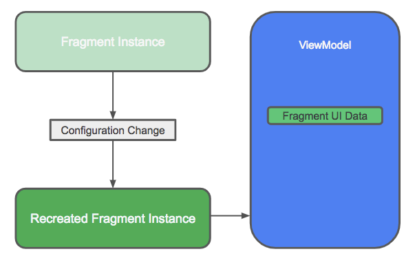
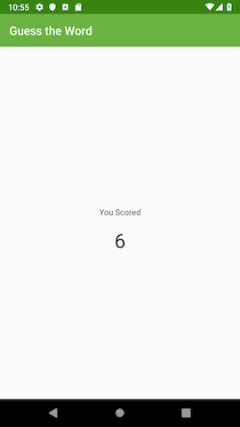

# 05-1_ViewModel and ViewModelFactory

## 1. App architecture
 - App architecture는 app 클래스들과 클래스들 사이의 관계를 디자인 하는 방법이다
 - 이번 단계에서는 GuessTheWord 앱을 Android app architecture 가이드라인에 따르게 만들고, Android Architecture Component를 사용한다
 - Android app architecture는 MVVM(model-view-viewmodel) 패턴과 유사하다다
 - GuessTheWord 앱은 관심사 분리([separation of concerns](https://en.wikipedia.org/wiki/Separation_of_concerns)) 디자인 패턴을 따르며 클래스로 나눠진다. 각 클래스는 별도의 관심사를 다룬다.
 - 가장 처음 다룰 클래스는 UI 컨트롤러, ViewModel, ViewModelFactory이다
 
 <br>
 
 ### 1) UI controller
  - UI controller는 UI 기반의 클래스로 Activity나 Fragment를 나타낸다
  - UI controller에는 UI를 다루거나 뷰를 표시하거나 user의 input을 capture하는 운영체제 상호 작용 로직만 포함되어야 한다
  - UI controller에는 어떤 텍스트를 표시할지 결정하는 로직과 같은 의사 결정 논리 코드를 넣지 않는다
  
  - GuessTheWord 앱에는 UI controller로 3가지 프래그먼트가 있다. (GameFragment, ScoreFragment, TitleFragment)
  - '관심사의 분리' 디자인 패턴에 따르면 GameFragment는 화면에 game 요소를 그리거나 사용자가 버튼을 누를 때를 아는 것만 책임 진다
  - 사용자가 버튼을 누르면 이 정보가 GameViewModel로 전달된다.
 
 <br>
 
 ### 2) ViewModel
  - ViewModel은 ViewModel과 연관된 activity나 fragment에 표시할 데이터를 가지고 있다.
  - ViewModel은 UI controller 표시할 데이터를 준비하기 위해 데이터에 대한 간단한 계산 및 변환을 수행한다
  - 이 아키텍처에서 ViewModel은 의사 결정을 수행한다
  - GameViewModel은 화면에 데이터를 뿌리기 위해 점수 값, 단어 목록, 현재 단어와 같은 데이터를 보유한다.
  - GameViewModel에는 데이터의 현재 상태를 결정하기 위해 간단한 계산을 수행하는 비즈니스 로직도 포함되어 있다
  
 <br>
 
 ### 3) ViewModelFactory
  - ViewModelFactory는 생성자 매개 변수를 사용하거나 사용하지 않고, viewModel 개체를 인스턴스화한다.
 
   
  
<br><br>

## 2. Create the GameViewModel
 - ViewModel 클래스는 UI 관련 데이터를 저장하고 관리하도록 설계되었다
 - 이 앱에서는 각 ViewModel은 하나의 프래그먼트와 관련되어있다
 - 이번 단계에서는 앱에 GameFragment를 위한 첫번째 viewModel인 GameViewModel을 추가하고, viewModel의 lifecycle을 인지한다.

 <br>
 
 ### Step 1: Add the GameViewModel class
  ##### 1) build.gradle(module:app) 파일을 열어서 dependenies 블록에 viewModel 디펜던시를 추가한다. 
  ```
  //ViewModel
  implementation 'androidx.lifecycle:lifecycle-viewmodel-ktx:2.2.0'
  ```
  
  ##### 2) screens/game 폴더 안에 GameViewModel 클래스를 추가한다
  
  ##### 3) GameViewModel 클래스를 추상 클래스 ViewModel을 상속받도록 만든다

  ##### 4) ViewModel의 lifecycle을 이해하기 쉽게 init 블록에 log를 찍어본다.
  
  ```
  class GameViewModel : ViewModel() {
     init {
         Log.i("GameViewModel", "GameViewModel created!")
     }
  }
  ```
 
 <br>
 
 ### Step 2: Override onCleared() and add logging
  - 관련 액티비티가 종료되거나 fragment가 detach 될 때 관련된 viewModel은 destroy된다
  - viewModel이 destroy 되기 바로 직전에 onCleared() 콜백이 호출되고 리소스를 정리한다
  
  ##### 1) GameViewModel 클래스에서 onCleared() 메소드를 오버라이드 한다
  
  ##### 2) onCleared()에 log를 추가한다
  
  ```
  override fun onCleared() {
     super.onCleared()
     Log.i("GameViewModel", "GameViewModel destroyed!")
  }
  ```
 
 <br>
 
 ### Step 3: GameViewModel과 GameFragment 연결
  - viewModel은 UI controller와 연결이 필요한데 두개를 연결시키기 위해 UI controller에서 ViewModel 레퍼런스를 생성해야 한다
  - 이번 단계에서는 UI controller인 GameFragment에 GameViewModel 레퍼런스를 생성하는 코드를 추가한다
  
  - GameFragment에 클래스 변수로 GameViewModel 타입의 필드를 추가한다
  
  ```
  private lateinit var viewModel: GameViewModel
  ```
 
 <br>
 
 ### Step 4: Initialize the ViewModel
  - 화면 회전 등의 configuration 변화 중에 fragment와 같은 UI controller는 re-create 되지만 ViewModel 인스턴스는 살아남는다.
  - ViewModel 클래스를 사용하여 ViewModel 인스턴스를 만들면 그 객체는 프래그먼트가 re-create 될 때 마다 다시 생성된다. 대신에 [ViewModelProvider](https://developer.android.com/reference/android/arch/lifecycle/ViewModelProvider)를 사용하여 인스턴스를 생성해라
  - viewModel 객체를 생성하기 위해 ViewModel을 직접 인스턴스화 하기보다는 **viewModelProvider**를 사용해라

  


  - **ViewModelProvider** 동작 방법
    - ViewModelProvider는 ViewModel 객체가 이미 존재하면 존재하는 ViewModel 객체를 리턴하고. 존재하지 않을 경우에 새로 생성한다
    - ViewModelProvider는 지정된 범위(activity, fragment)와 관련하여 viewModel 인스턴스를 생성한다
    - 범위(scope)가 활성 상태일 경우 생성된 viewModel은 유지된다. 예를 들어 scope가 fragment일 경우 해당 viewModel은 fragment가 detach 될 때 까지 유지된다
  
  - ViewModel을 초기화하려면 viewModelProvider를 생성하는 [ViewModelProviders.get()](https://developer.android.com/reference/android/arch/lifecycle/ViewModelProviders.html#of) 메소드를 사용한다.
  
  ##### 1) GameFragment 클래스에서 viewModel 변수를 초기화한다. 아래 코드를 onCreateView() 메소드에 binding 변수 정의 이후에 추가한다. ViewModelProviders.get() 메소드를 사용해서 연결된 GameFragment의 context와 GameViewModel 클래스를 전달해라
  
  ```
  Log.i("GameFragment", "Called ViewModelProvider.get")
  viewModel = ViewModelProvider(this).get(GameViewModel::class.java)
  ```
  
  <br>

  ##### 2) 앱을 실행시키고 Logcat 패널을 열어 'Game' 키워드로 검색해본다. Play 버튼을 누르면 game screen이 열린다.
  Logcat을 살펴보면 GameFragment의 onCreateView()에서 GameViewModel을 생성하는 ViewModelProvider.get()을 호출하는 것을 알 수 있다.
  GameFragment와 GameViewModel에서 추가한 log를 Logcat에서 확인할 수 있다.

  ```
  2021-02-17 10:45:19.451 32270-32270/com.example.android.guesstheword I/GameFragment: Called ViewModelProvider.get
  2021-02-17 10:45:19.454 32270-32270/com.example.android.guesstheword I/GameViewModel: GameViewModel created!
  ```

  ##### 3) 디바이스나 에뮬레이터에서 화면 회전을 몇번 반복한다. GameFragment는 destroyed 되고 re-create 되므로 ViewModelProviders.get() 메소드는 여러번 호출된다. GameViewModel은 한번 생성이 되면, 호출할 때마다 destroy하고 re-create 하지 않는다
  ```
  2021-02-17 10:45:19.451 32270-32270/com.example.android.guesstheword I/GameFragment: Called ViewModelProvider.get
  2021-02-17 10:45:19.454 32270-32270/com.example.android.guesstheword I/GameViewModel: GameViewModel created!
  2021-02-17 10:47:54.978 32270-32270/com.example.android.guesstheword I/GameFragment: Called ViewModelProvider.get
  2021-02-17 10:48:12.694 32270-32270/com.example.android.guesstheword I/GameFragment: Called ViewModelProvider.get

  ```
  
  <br>
  
  ##### 4) 앱을 종료하거나 game fragment에서 나가면 GameFragment는 destroy 된다. 연결된 GameViewModel도 destroy 되며 onCleared() 콜백이 호출된다
  ```
  2021-02-17 10:50:54.113 32460-32460/com.example.android.guesstheword I/GameFragment: Called ViewModelProvider.get
  2021-02-17 10:50:54.118 32460-32460/com.example.android.guesstheword I/GameViewModel: GameViewModel created!
  2021-02-17 10:51:12.514 32460-32460/com.example.android.guesstheword I/GameFragment: Called ViewModelProvider.get
  2021-02-17 10:51:17.421 32460-32460/com.example.android.guesstheword I/GameFragment: Called ViewModelProvider.get
  2021-02-17 10:51:25.631 32460-32460/com.example.android.guesstheword I/GameViewModel: GameViewModel destroyed!
  ```

<br><br>

 ## 3. Populate the GameViewModel
  - viewModel은 configuration 변화에 살아남는다. 따라서 configuration 변화에 살아남을 데이터를 저장하기에 좋다
    - 화면에 표시할 데이터와 데이터를 처리할 코드를 viewModel에 넣는다
    - activity, fragment, view는 configuration이 변할 때 살아남지 못하므로 viewModel에 activity, fragment, view의 레퍼런스는 넣지 않는다
    
  
  
  - 비교를 위해 viewModel을 추가하기 전과 viewModel을 추가한 후 앱에서 데이터를 처리하는 방법은 다음과 같다
    - ViewModel 추가 전: screen 회전과 같은 configuration 변화가 발생하면 game fragment는 destroy 되고 re-create 된다. 데이터는 잃게된다
    - viewModel 추가 후: game fragment의 UI 데이터는 viewModel로 옮겨졌다. 프래그먼트가 표시해야 할 데이터는 모두 viewModel이다. 앱에서 configuration 변화가 발생하면 viewModel은 살아남고 데이터도 유지된다.
    
  <br>

  이번 실습에서는 app의 UI data와 data를 처리하는 메소드를 GameViewModel 클래스로 옮긴다. 이렇게 하면 configuration 변경 중에 데이터가 유지된다.
  
  ### Step 1: Move data fields and data processing to the ViewModel
   - GameFragment에 있는 데이터 필드와 메소드를 GameViewModel로 옮긴다
   
   ##### 1) word, score, wordList 데이터 필드를 옮기고 word, score는 private으로 하지 않는다.
    - binding 데이터인 GameFragmentBinding은 뷰에 대한 참조가 포함되어 있으므로 GameViewModel 클래스로 옮기지 않는다
    - binding 변수는 레이아웃을 inflate 시키고 클릭 리스너를 설정하며 화면에 데이터를 표시하는 데 사용된다. (즉 fragment 책임)
   <br>
   
   ##### 2) resetList()와 nextWord() 메소드를 이동시킨다. 이 메소드들은 화면에 어떤 단어를 보여줘야 하는지 결정한다
   
   ##### 3) resetList()와 nextWord() 메소드 호출을 GameFragment의 onCreateView()에서 GameViewModel init 블록으로 이동시킨다.
   이 메소드 호출은 init 블럭에 있어야 한다. 그 이유는 fragment가 create될 때마다 word list를 reset하는게 아니라 viewModel이 create 될 때 word list를 reset 하기 때문이다.
   
  <br>
  
   - onSkip()과 onCorrect()는 GameFragment의 click handler로, 데이터를 처리하고 UI를 업데이트 시키는 코드가 포함되어 있다.
   - UI를 업데이트 하는 코드는 fragment 내에서 유지되어야 하지만 데이터를 처리하는 코드는 viewModel로 이동해야 한다
   
   ##### 1) onSkip()과 onCorrect() 메소드를 GameFragment로부터 GameViewModel로 복사한다
   
   ##### 2) GameFragment에서 GameViewModel의 onSkip()과 onCorrect() 메소드를 참조해야 하므로 메소드가 private이 아닌 것을 확인한다.

   GameViewModel 클래스의 코드는 다음과 같다.

   ```
    class GameViewModel : ViewModel() {
       // The current word
       var word = ""
       // The current score
       var score = 0
       // The list of words - the front of the list is the next word to guess
       private lateinit var wordList: MutableList<String>

       /**
        * Resets the list of words and randomizes the order
        */
       private fun resetList() {
           wordList = mutableListOf(
                   "queen",
                   "hospital",
                   "basketball",
                   "cat",
                   "change",
                   "snail",
                   "soup",
                   "calendar",
                   "sad",
                   "desk",
                   "guitar",
                   "home",
                   "railway",
                   "zebra",
                   "jelly",
                   "car",
                   "crow",
                   "trade",
                   "bag",
                   "roll",
                   "bubble"
           )
           wordList.shuffle()
       }

       init {
           resetList()
           nextWord()
           Log.i("GameViewModel", "GameViewModel created!")
       }
       /**
        * Moves to the next word in the list
        */
       private fun nextWord() {
           if (!wordList.isEmpty()) {
               //Select and remove a word from the list
               word = wordList.removeAt(0)
           }
           updateWordText()
           updateScoreText()
       }
     /** Methods for buttons presses **/
       fun onSkip() {
           score--
           nextWord()
       }

       fun onCorrect() {
           score++
           nextWord()
       }

       override fun onCleared() {
           super.onCleared()
           Log.i("GameViewModel", "GameViewModel destroyed!")
       }
    }
   ```

   GameFragment 코드는 아래와 같다


   ```
    /**
    * Fragment where the game is played
    */
    class GameFragment : Fragment() {


       private lateinit var binding: GameFragmentBinding


       private lateinit var viewModel: GameViewModel


       override fun onCreateView(inflater: LayoutInflater, container: ViewGroup?,
                                 savedInstanceState: Bundle?): View? {

           // Inflate view and obtain an instance of the binding class
           binding = DataBindingUtil.inflate(
                   inflater,
                   R.layout.game_fragment,
                   container,
                   false
           )

           Log.i("GameFragment", "Called ViewModelProvider.get")
           viewModel = ViewModelProvider(this).get(GameViewModel::class.java)

           binding.correctButton.setOnClickListener { onCorrect() }
           binding.skipButton.setOnClickListener { onSkip() }
           updateScoreText()
           updateWordText()
           return binding.root

       }


       /** Methods for button click handlers **/

       private fun onSkip() {
           score--
           nextWord()
       }

       private fun onCorrect() {
           score++
           nextWord()
       }


       /** Methods for updating the UI **/

       private fun updateWordText() {
           binding.wordText.text = word
       }

       private fun updateScoreText() {
           binding.scoreText.text = score.toString()
       }
    }
   ```


  <br>
  
  ### Step 2: Update references to click handlers and data fields in GameFragment
   ##### 1) GameFragment에서 점수를 업데이트 하는 코드를 제거하고 대신 viewModel의 onSkip() 및 onCorrect() 메소드를 호출하도록 변경한다
   
   ##### 2) nextWord() 메소드를 viewModel로 옮겼기 떄문에 gameFragment에서는 더이상 접근할수 없다
   
   - GameFragment에서 onSkip()과 onCorrect() 메소드 안의 nextWord()를 updateScoreText()와 updateWordText()를 호출하는 코드로 변경한다
   - 이 메소드는 화면에 데이터를 보여준다
     
   ```
    private fun onSkip() {
       viewModel.onSkip()
       updateWordText()
       updateScoreText()
    }
    private fun onCorrect() {
       viewModel.onCorrect()
       updateScoreText()
       updateWordText()
    }
   ```
   
   <br>
   
   ##### 3) GameFragment에서 score와 word 변수를 GameViewModel의 score와 word 변수로 수정한다
   
   ```
   private fun updateWordText() {
      binding.wordText.text = viewModel.word
   }
   
   private fun updateScoreText() {
      binding.scoreText.text = viewModel.score.toString()
   }
   ```
   
   <br>
   
   ##### 4) GameViewModel 내부에 있는 nextWord() 메소드에서 updateWordText()와 updateScoreText() 메소드를 지운다. 이 메소드들은 GameFragment에 의해 호출된다.
   
   ##### 5) 앱을 실행시켜 게임을 진행해보고 디바이스를 회전시킨다. 현재 스코어와 현재 단어가 화면 방향이 바뀌어도 유지되는 것을 확인할 수 있다

<br><br>

 ## 4. Implement click listener for the End Game button
  이번 실습에서는 End Game 버튼의 click listener를 구현한다.

  #### 1) GameFragment에 onEndGame() 메소드를 추가한다. onEndGame() 메소드는 End Game 버튼을 탭 할 때 호출된다.
  
  ```
  private fun onEndGame(){

  }
  ```
  
  <br>

  #### 2) GameFragment의 onCreateView() 메소드 내에 Got It, Skip 버튼의 click listenr 바로 아래에 EndGame 버튼의 click listner를 등록한다. 바인딩 변수인 binding을 사용하여 click listner 내에서 onEndGame() 메소드를 호출한다.
  ```
  binding.endGameButton.setOnClickListener { onEndGame() }
  ```
  
  <br>
  
  #### 3) GameFragment에 scoreScreen으로 이동하는 gameFinishsed() 메소드를 추가한다. [Safe Args](https://developer.android.com/topic/libraries/architecture/navigation/navigation-pass-data#Safe-args)를 이용하여 score를 argument로 넘긴다
   ```
   /**
   * Called when the game is finished
   */
   private fun gameFinished() {
      Toast.makeText(activity, "Game has just finished", Toast.LENGTH_SHORT).show()
      val action = GameFragmentDirections.actionGameToScore()
      action.score = viewModel.score
      NavHostFragment.findNavController(this).navigate(action)
   }
   ```
   
   <br>
   
  #### 4) onEndGame() 메소드에서 gameFinished() 메소드를 호출한다
  ```
  private fun onEndGame() {
     gameFinished()
  }
  ```
  
  <br>
  
  #### 5) End Game 버튼을 누르면 score screen으로 이동하는 것을 알 수 있다. 그러나 final score는 표시되지 않고 있다. 다음 단계에서 해결해보자
  
  <br><br>
  
 ## 4. Use a ViewModelFactory
  - 사용자가 게임을 끝내면 ScoreFragment에서 viewModel에 있는 score 값을 보여주는 작업을 진행해보자
  - [팩토리 메소드 패턴](https://en.wikipedia.org/wiki/Factory_method_pattern)을 사용하여 ViewModel이 초기화 되는 중에 score 값을 전달한다
  - 팩토리 메소드 패턴은 팩토리 메소드를 이용하여 오브젝트를 생성하는 [creational design pattern](https://en.wikipedia.org/wiki/Creational_pattern)이다
  - 팩토리 메소드는 동일한 클래스의 인스턴스를 리턴하는 메소드이다
  
  - 이번 단계에서는 score fragment를 위한 ViewModel을 만들고 ViewModel을 인스턴스화 하는 팩토리 메소드를 생성한다
  
  ##### 1) score 패키지 내에 scoreFragment를 위한 ScoreViewModel을 만든다 
  
  ##### 2) ScoreViewModel 클래스는 ViewModel을 상속받고 생성자 파라미터에 최종 점수를 추가한다.
  
  ##### 3) ScoreViewModel 클래스에서 최종 점수를 score 변수에 추가한다
  
  ```
  class ScoreViewModel(finalScore: Int) : ViewModel() {
     // The final score
     var score = finalScore
     init {
         Log.i("ScoreViewModel", "Final score is $finalScore")
     }
  }
  ```
  
  <br>
  
  ##### 4) score 패키지 아래에 ScoreViewModelFactory라는 새로운 클래스를 만든다. 이 클래스는 ScoreViewModel 객체를 인스턴스화 시키는 역할을 한다
  
  ##### 5) ScoreViewModelFactory클래스는 ViewModelProvider.Factory 클래스를 상속받는다. 생성자 파라미터로 final score를 추가한다.
  
  ```
  class ScoreViewModelFactory(private val finalScore: Int) : ViewModelProvider.Factory {

  }
  ```
  

  <br>
  
  ##### 6) 5)번의 작업을 진행하면 안드로이드 스튜디오에서 unimplemented abstract method 에러가 나온다. 에러를 해결하기 위해 create() 메소드를 오버라이드 하고 create() 메소드에서 새로 생성된 scoreViewModel 객체를 리턴한다
  
  ```
  override fun <T : ViewModel?> create(modelClass: Class<T>): T {
     if (modelClass.isAssignableFrom(ScoreViewModel::class.java)) {
         return ScoreViewModel(finalScore) as T
     }
     throw IllegalArgumentException("Unknown ViewModel class")
  }
  ```
  
  <br>
  
  ##### 7) ScoreFragment에서 ScoreViewModel과 ScoreViewModelFactory 클래스의 변수를 생성한다
  
  ```
  private lateinit var viewModel: ScoreViewModel
  private lateinit var viewModelFactory: ScoreViewModelFactory
  ```
  
  <br>
  
  ##### 8) ScoreFragment의 onCreateView() 안에서 binding 변수를 초기화 한 후 ScoreViewModelFactory를 사용하여 viewModelFactory를 초기화한다.
   - argument bundle에 있는 final score를 ScoreViewModelFactory()에 생성자 파라미터로 넘겨준다
   
   ```
    viewModelFactory = ScoreViewModelFactory(ScoreFragmentArgs.fromBundle(arguments!!).score)
   ```
   
  <br>
  
  ##### 9) onCreateView()에 viewModelFactory 초기화하고 난 후 viewModel 객체를 초기화한다. 
   - ViewModelProvider.get() 메소드를 호출하여 연결된 scoreFragment의 context와 viewModelFactory를 넘긴다
   - ViewModelFactory 클래스에 정의된 팩토리 메소드를 이용하여 ScoreViewModel 객체를 생성한다
  
  ```
   viewModel = viewModelProvider.of(this, viewModelFactory)
                .get(ScoreViewModel::class.java)
  ```
  
  <br>
  
  ##### 10) onCreateView()에서 viewModel을 초기화 한 후에 scoreText 뷰의 텍스트를 ScoreViewModel에 있는 final score로 설정한다
  ```
   binding.scoreText.text = viewModel.score.toString()
  ```
  
  <br>
  
  ##### 11) 앱을 실행시키고 End Game을 누르면 score fragment에 최종 점수가 뜨는 것을 확인할 수 있다.

  
   
    
  ##### 12) optional: ScoreViewModel의 키워드로 Logcat에서 ScoreViewModel 로그를 검색해보자.

  ```
  2021-02-17 11:47:45.521 622-622/com.example.android.guesstheword I/ScoreViewModel: Final score is 6
  ```

  **Note**: 이 앱에서는 viewModel.score 변수에 직접 할당할 수 있으므로 ScoreViewModel에 대한 ViewModelFactory를 추가할 필요는 없다. 그러나 때로 viewModel이 초기화 될 때 바로 데이터가 필요할 수도 있다
