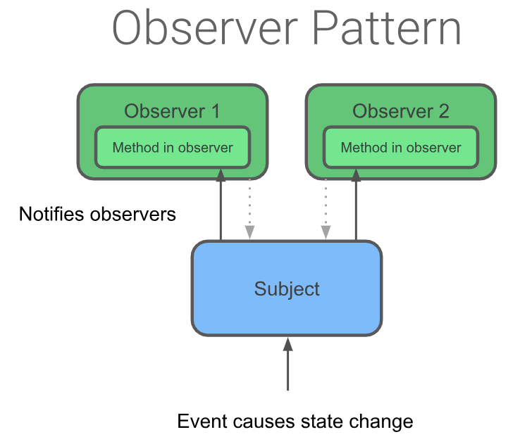

# 05-2 LiveData and LiveDataObjservers

## 1. Add LiveData to the GameViewModel
 - LiveData는 수명주기를 인식하는 observable data holder 클래스이다. 예를 들어 GuessTheWord 앱에서 현재 점수를 LiveData에 wrap 할 수 있다
 - LiveData의 특징은 다음과 같다
    - LiveData는 observable하다. 이 의미는 LiveData의 객체가 보유한 데이터가 변경될 때 observer에게 통보됨을 의미한다
    - LiveData는 데이터를 가지고 있다. LiveData는 모든 데이터와 함께 사용할 수 있는 래퍼이다
    - LiveData는 수명주기를 인식한다(lifecycle-aware) 이는 STARTED와 RESUMED와 같은 활성 라이프사이클 상태에 있는 observer만 업데이트 한다
 
 - 이 단계에서는 어떤 GameViewModel의 current score와 current word 데이를 LiveData로 변환하여 모든 데이터 유형을 LiveData 객체로 래핑하는 방법을 배운다
 
 <br>
 
 ### Step 1: Change the score and word to user LiveData
  #### 1) GameViewModel 파일을 열어서 socre와 word를 MutableLiveData 타입으로 변환한다
   - MutableLiveData는 변할 수 있는 LiveData이다. 
   - MutableLiveData는 generic class이므로 데이터 타입을 지정해야 한다
   
   ```
    // The current word
    var word = MutableLiveData<String>()

    // The current score
    var score = MutableLiveData<Int>()
   ```
   
   <br>
   
   ### 2) GameViewModel 클래스의 init 블럭에서 score와 word를 초기화한다. 
   - LiveData 값을 변경하기 위해서는 setValue() 메소드를 사용해야 한다. 
   - 코틀린에서는 setValue()를 value 프로퍼티를 사용하여 호출할 수 있다
   
   ```
    init {
    
       word.value = ""
       score.value = 0
      ...
    }
   ```
   
 <br><br>
   
 ### Step 2: Update the LiveData object reference
  
  #### 1) GameViewModel 클래스의 onSkip() 메소드에서 score를 score.value로 변경한다. score가 nullable 타입이므로 에러가 발생한다
  
  #### 2) 에러를 해결하기 위해 onSkip() 메소드에서 score.value 널 체크를 추가한다. 아래와 같이 null-safety로 minus() 메소드를 수행한다
  
  ```
   fun onSkip() {
    if(!wordList.isEmpty()) {
      score.value = (score.value)?.minus(1)
    }
    nextWord()
   }
  ```
  
  <br>
  
  #### 3) onCorrect() 메소드를 위와 같은 방식으로 plus() 메소드를 사용하여 업데이트 한다
  
  ```
   fun onCorrect() {
     if(!wordList.isEmpty()) {
       score.value = (score.value)?.plus(1)
     }
     nextWord()
   }
  ```
  
  <br>
  
  #### 4) GameViewModel 클래스의 nextWord() 메소드의 word를 word.value로 변경한다
  
  ```
   private fun nextWord() {
     if(!wordList.isEmpty()){
       word.value = wordList.removeAt(0)
     }
   }
  ```
  
  <br>
  
  #### 5) GameFragment의 updateWordText() 메소드에서 viewModel.word를 viewModel.word.value로 변경한다
  
  ```
   private fun updateWordText(){
     binding.wordText.text = viewModel.word.value
   }
  ```
  
  <br>
  
  #### 6) GameFragment의 updateScoreText()를 viewModel.score에서 viewModel.score.value로 변경한다
  
  ```
   private fun updateScoreText() {
      binding.scoreText.text = viewModel.score.value.toString()
   }
  ```
  
  <br>
  
  #### 7) GameFragment의 gameFinished() 메소드에서 viewModel.score를 viewModel.score.value로 바꾸고 null-safety check를 추가한다
  
  ```
   private fun gameFinished(){
      ...
      action.score = viewModel.score.value?:0
      ...  
   }
  ```
  
   
 <br><br>
   
 ### Step 3: Attach observers to the LiveData objects
  - 이번 단계에서는 Observer 객체를 LiveData 객체와 연결한다
  
  #### 1) GameFragment의 onCreateView() 메소드에서 viewModel.score에 대한 Observer 객체를 LiveData 객체에 연결한다.
   - viewModel이 초기화 코드 아래에 observe() 메소드 코드를 추가한다
   
   ```
    viewModel.score.observe(this, Observer { newScore ->
        
    })
   ```
  
  <br>
  
  ### 2) 방금 만든 observer는 LiveData 객체가 보유한 데이터가 변경될 때 이벤트를 받는다.
   - observer 내에서 newScore 값으로 TextView를 업데이트 하는 코드를 추가한다
   
  ```
   /** Setting up LiveData observation relationship **/
    viewModel.score.observe(this, Observer { newScore -> 
      binding.scoreText.text = newScore.toString()
    })
  ```
  
  <br>
  
  ### 3) current word LiveData에 Observer 객체를 연결한다. 2)번과 동일하게 진행한다.
  
  ```
   /** Setting up LiveData observation relationship **/
   viewModel.word.observe(this, Observer { newWord ->
      binding.wordText.text = newWord
   })
  ```
  
  - score와 word가 변하면 이제 스크린에서 자동으로 업데이트 되어 나타날 것이다
  
  <br>
  
  ### 4) GameFragment에서 updateWordText()와 updateScoreText() 메소드를 지운다. LiveData observer 메소드에 의해 자동으로 업데이트 되므로 더이상 필요하지 않다
  
  <br><br>
  
## 2. Encapsulate the LiveData
 - 캡슐화는 객체의 일부 필드에 대한 직접 액세스를 제한하는 방법이다
 - 객체를 캡슐화하면 private한 내부 필드를 변경하는 public 메소드를 노출시킨다
 - 캡슐화를 사용하여 다른 클래스로 내부 필드를 조작할 수 있다
 
 - 현재 코드에서는 외부클래스에서 viewModel.score.value와 같이 value 프로퍼티를 사용하여 score나 word값을 변경할 수 있다
 - 오로지 viewModel만 데이터를 편집할 수 있어야한다. 그러나 UI controller는 데이터를 읽어야 하므로 데이터 필드는 완전히 private이 될 수 없다
 - 앱의 데이터를 캡슐화 하기 위해 MutableLiveData와 LiveData 객체를 모두 사용해야 한다
 
 - MutableLiveData vs LiveData
    - MutableLiveData에 있는 데이터는 변할 수 있는 객체이며 viewModel 내에서 데이터를 편집할 수 있다
    - LiveData 객체는 읽을 수 있지만 값이 바뀔 수 없다. viewModel 밖에서 데이터를 편집하지 않고 읽어야 할 때 LiveData 형식으로 내보낸다.
 
 - 이 방식을 수행하려면 Kotlin의 [bacaking.property](https://kotlinlang.org/docs/reference/properties.html#backing-properties)를 사용한다
 
 <br>
 
 #### Add a backing property to score and word
 
  ##### 1) GameViewModel에서 score 객체를 private으로 만든다
  
  ##### 2) backing property에서 사용된 네이밍 규칙을 따르기 위해 score를 _score로 바꾼다. _score 프로퍼티는 이제 mutable 버전의 game score이며 내부적으로만 사용된다
  
  ##### 3) score라고 불리는 LiveData 타입의 public 버전도 만든다
  
  ```
  // The current score
  private val _score = MutableLiveData<Int>()
  val score: LiveData<Int>
  ```
  
  ##### 4) 3)번을 끝내면 initialization 에러를 볼 수 있다. 이 에러는 GameFragment에서 score가 LiveData의 참조형 데이터인데 더이상 score의 setter에 접근할 수 없기 때문에 발생한다. 
   - 에러를 해결하기 위해서 score 객체에서 get()을 오버라이드 하고 backing property인 _score를 리턴한다
   
   ```
   val score: LiveData<Int>
        get() = _score
   ```
   
  ##### 5) GameViewModel에서 score 참조를 _score 가변 참조로 변경한다
  
  ```
  init {
     ...
     _score.value = 0
     ...
  }
  
  ...
  fun onSkip() {
     if (!wordList.isEmpty()) {
         _score.value = (score.value)?.minus(1)
     }
    ...
  }
  
  fun onCorrect() {
     if (!wordList.isEmpty()) {
         _score.value = (score.value)?.plus(1)
     }
     ...
  }
  ```
  
  <br>
  
  ##### 6) word 객체도 마찬가지로 객체 이름을 _word로 변경하고 backing property를 추가한다. score에서 하던 작업을 반복한다
  ```
  // The current word
  private val _word = MutableLiveData<String>()
  val word: LiveData<String>
     get() = _word
  ...
  init {
     _word.value = ""
     ...
  }
  ...
  private fun nextWord() {
     if (!wordList.isEmpty()) {
         //Select and remove a word from the list
         _word.value = wordList.removeAt(0)
     }
  }
  ```

  <br><br>
  
## 3. Add a game-finished event
 - 플레이어가 마지막 단어 게임을 끝냈을 때 자동으로 점수 화면으로 이동시키는 작업을 추가한다
 - 이 기능을 구현하려면 모든 단어가 표시되었을 때 이벤트가 트리거되고 viewModel에서 fragment로 이벤트가 전달되어야 한다
 - LiveData oberver pattern을 사용하여 게임 종료 이벤트를 설계해보자
 
 ### The observer pattern
  - 옵저버 패턴은 소프트웨어 디자인 패턴이다. observable("subject" of observation)과 observer 객체 사이에서 커뮤니케이션을 주고 받는다
  - observable은 상태가 변화하면 observer에게 알리는 객체이다
  
  
  
  - LiveData의 경우 observable(subject)는 LiveData 객체이며 observer는 UI controller의 메소드이다
  - LiveData로 감싸진(wrapped) 데이터가 변경될 때 마다 상태도 변한다
  - LiveData 클래스는 viewModel에서 프래그먼트로 통신하는 데 중요하다
  
  #### Step 1: Use LiveData to detect a game-finished event
  
  ##### 1) GameViewModel에서 Boolean 형식의 MutableLiveData 오브젝트를 만들고 이름을 _eventGameFinish로 지정한다. 이 객체는 게임 종료 이벤트를 가진다
  
  ##### 2) _eventEventFinish() 초기화가 끝나면 eventGameFinish라는 이름의 backing property를 생성하고 초기화한다
  
  ```
    // Event which triggers the end of the game
    private val _eventGameFinish = MutableLiveData<Boolean>()
    val eventGameFinish: LiveData<Boolean>
       get() = _eventGameFinish
  ```
  
  <br>
  
  ##### 3) GameViewModel에 onGameFinish() 메소드를 추가하고 eventGameFinish를 true로 설정한다
  
  ```
   fun onGameFinish(){
     _eventGameFinish.value = true
   }
  ```
  
  <br>
  
  ##### 4) GameViewModel의 nextWord() 메소드에 word list가 빈 값이면 game을 끝내도록 추가한다
  ```
  private fun nextWord() {
     if (wordList.isEmpty()) {
         onGameFinish()
     } else {
         //Select and remove a _word from the list
         _word.value = wordList.removeAt(0)
     }
  }
  ```
  
  ##### 5) GameFragment의 onCreateView() 메소드에서 viewModel 초기화 코드 이후에 observe() 메소드를 사용하여 observer를 eventGameFinish와 연결하는 코드를 추가한다
  
  ```
  // Observer for the Game finished event
  viewModel.eventGameFinish.observe(this, Observer<Boolean> { hasFinished ->
     if (hasFinished) gameFinished()
  })
  ```
  
  <br>
  
  ##### 6) 추가한 코드에 lifecycle 이슈가 발생했다. 이슈를 알아보기 위해 GameFragment의 gameFinish() 메소드에서 Toast 코드만 남기고 navigation 코드들을 다 주석처리한다.
 
  ```
  private fun gameFinished() {
         Toast.makeText(activity, "Game has just finished", Toast.LENGTH_SHORT).show()
  //        val action = GameFragmentDirections.actionGameToScore()
  //        action.score = viewModel.score.value?:0
  //        NavHostFragment.findNavController(this).navigate(action)
     }
  ```
  
  ##### 7) 앱을 실행하고 게임이 종료되면 "Game has just finished"라는 메세지가 나타난다. 그러나 디바이스를 회전시킬 때마다 Toast 메세지는 매번 나타난다. 토스트 메세지는 게임이 끝날 때 한번만 나와야 되기 때문에 이것은 버그이다. 토스트 메세지는 fragment가 re-create 될 때마다 보여지면 안된다
  
  <br><br>
  
 #### Step 2: Reset the game-finished event
  
  - 보통 LiveData는 데이터가 변할 때 마다 observer에게 업데이트를 전달한다
  - 이 동작의 예외는 observer가 비활성 상태에서 활성 상태로 변경될 때 observer가 update를 수신한다는 점이다
  - 화면을 회전시켜서 game fragment가 re-create 되면 inactive 상태에서 active 상태가 된다. 이 때 fragment의 observer는 기존 viewModel에 다시 연결되고 현재 데이터를 수신한다
  - 이번 단계에서 eventGameFinish 플래그를 재설정하여 토스트가 한번만 뜨도록 수정한다
  
  <br>
  
  ##### 1) GameViewModel에 onGameFinishComplete() 메소드를 추가하고 _eventGameFinish 값을 재설정한다
  
  ```
   fun onGameFinishComplete() {
    _eventGameFinish.value = false
   }
  ```
  
  <br>
  
  ##### 2) GameFragment의 gameFinished() 마지막에 onGameFinishComplete()을 호출한다.
  
  ```
  private fun gameFinished() {
     ...
     viewModel.onGameFinishComplete()
  }
  ```
  
  <br>
  
  ##### 3) 앱을 실행시켜서 Toast가 한번만 뜨는지 확인한다.


  <br><br>
  
## 4. Add LiveData to the ScoreViewModel
 - 이번 단계에서는 ScoreViewModel에서 score를 LiveData 객체로 바꾸고 observer와 연결시킨다
 - 이 작업은 GameViewModel에 LiveData를 추가할 때 했던 작업과 유사하다
 
 #### 1) ScoreViewModel에서 score 변수 타입은 MutableLiveData로 변경한다. backing property를 추가하고 _score로 변경한다
 
 ```
 private val _score =  MutableLiveData<Int>()
 val score: LiveData<Int>
     get() = _score

 ```
 
 <br>
 
 #### 2) ScoreViewModel의 init 블록에서 _score를 초기화한다.
 ```
 init {
    _score.value = finalScore
 }
 ```
 
 <br>
 
 #### 3) ScoreFragment의 onCreateView()에서 viewModel 초기화 코드 이후에 score LiveData 객체를 observer와 연결시키는 코드를 추가한다
 
  - viewModel에 있는 score 값으로 text view에 직접 할당하는 코드는 삭제한다
  
  ```
  // remove
  binding.scoreText.text = viewModel.score.toString()
  
  // Add observer for score
  viewModel.score.observe(this, Observer { newScore ->
     binding.scoreText.text = newScore.toString()
  })
  ```

  <br><br>
  
## 5. Add the Play Again button
 - 이번 단계에서는 LiveData 이벤트를 사용하여 클릭 리스너를 구현하는 Play Again 버튼을 score screen에 추가하려고 한다
 - 버튼은 score screen에서 game screen으로 이동하는 이벤트를 트리거한다
 
 #### 1) res/layout/score_fragment.xml에서 play_again_button의 visibility를 visible로 바꾼다
 
 ```
 <Button
    android:id="@+id/play_again_button"
 ...
    android:visibility="visible"
  />
 ```
 
 #### 2) ScoreViewModel에서 _eventPlayAgain을 이름으로 하는 Boolean타입의 LiveData를 추가한다. 이 객체는 score screen에서 game screen으로 이동하는 LiveData 이벤트를 저장하는데 사용하는 객체이다
 
 ```
  private val _eventPlayAgain = MutableLiveData<Boolean>()
  val eventPlayAgain: LiveData<Booelan>
  
 ```
 
 <br>
 
 #### 3) ScoreViewModel에서 _eventPlayAgain 값을 설정하는 함수를 만든다
 
 ```
 fun onPlayAgain() {
     _eventPlayAgain.value = true
 }

 fun onPlayAgainComplete() {
     _eventPlayAgain.value = false
 }
 ```
 
 <br>
 
 #### 4) ScoreFragment에 eventPlayAgain을 위한 observer를 만든다. 
 ```
 // Navigates back to game when button is pressed
 viewModel.eventPlayAgain.observe(this, Observer { playAgain ->
    if (playAgain) {
       findNavController().navigate(ScoreFragmentDirections.actionRestart())
        viewModel.onPlayAgainComplete()
    }
 })
 ```
 
 <br>
 
 #### 5) ScoreFragment의 onCreateView()에서 PlayAgain 버튼에 클릭 리스너를 추가하고 viewModel.onPlayAgain()을 호출한다
 
 ```
  binding.playAgainButton.setOnClickListener { viewModel.onPlayAgain() }
 ```
  
 #### 6) 이제 앱을 실행시켜서 최종 점수를 확인하고 Play Again 버튼을 탭한다. Play Again을 탭하면 게임을 다시 할 수 있는 game Screen으로 이동한다
 
  
  