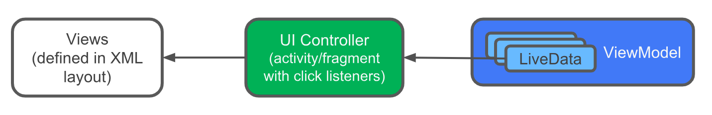
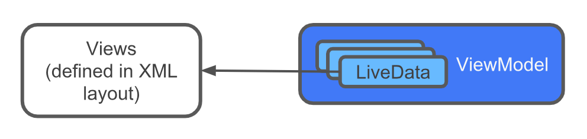

# 05-3 Databinding with ViewModel and LiveData

## 1. Add ViewModel data binding

 - 이전 단계에서 뷰에 액세스하는 안전한 형식으로 데이터 바인딩을 사용했다.
 - 그러나 data binding의 진정한 힘은 이름이 의미하는 대로 데이터를 앱의 뷰 객체에 직접 바인딩하는 것이다
 
 ### current app architecture
  앱에서 뷰는 XML 레이아웃으로 정의되며 해당 뷰의 데이터는 ViewModel 객체에 보관된다. 각 뷰와 해당 viewModel 사이에는 UI 컨트롤러가 있으며 이들 사이에 릴레이 역할을 한다
  
  
 
   - Got It 버튼은 game_fragment.xml 레이아웃 파일에 Button view로 정의되어 있다
   - Got it 버튼을 사용자가 탭하면 GameFragment의 클릭 리스너가 GameViewModel의 해당 클릭 리스너를 호출한다
   - score는 GameViewModel에서 업데이트 된다
 
  Button 뷰와 GameViewModel은 직접적으로 커뮤니케이션 하지 않는다. 단지 GameFragment에 있는 클릭 리스너만 필요하다
  
 <br>
 
 ### ViewModel passed into the data binding
  UI 컨트롤러를 매개체로 사용하지 않고 레이아웃의 뷰가 viewModel 객체의 데이터와 직접 통신하는 것이 더 간단하다
  
  
  
  ViewModel 객체는 앱의 모든 UI 데이터를 보유한다. ViewModel 객체를 데이터 바인딩으로 전달하면 뷰와 ViewModel 객체 간의 일부 통신을 자동화 할 수 있다
  
  이번 단계에서는 GameViewModel 및 ScoreViewModel 클래스를 해당 xml 레이아웃과 연결하고 클릭벤트를 처리할 리스너 바인딩도 설정한다
  
 <br><br>
 
 ### Step 1: Add data binding for the GameViewModel
 
 Step 1에서는 GameViewModel과 game_fragment.xml을 연결한다
 
 <br>
 
 #### 1) game_fragment.xml에 GameViewModel 타입 data-binding 의변수를 추가한다.
 
 ```
 <layout ...>
 
    <data>
 
        <variable
            name="gameViewModel"
            type="com.example.android.guesstheword.screens.game.GameViewModel" />
    </data>
   
    <androidx.constraintlayout...
 ```
 
 <br>
 
 #### 2) GameFragment 파일에서 GameViewModel을 data binding에 넘긴다
 ```
 // Set the viewmodel for databinding - this allows the bound layout access 
 // to all the data in the ViewModel
 
 binding.gameViewModel = viewModel
 ```
 
 <br><br>
 
 ### Step 2: Use listener bindings for event handling
  - Listener binding은 onClick(), onZoomIn(), onZoomOut()과 같은 이벤트가 트리거 될 때 실행되는 바인딩 표현식이다
  - Listener binding은 람다 식으로 작성된다
  
  - 데이터 바인딩은 리스너를 작성하고 뷰에서 리스너를 설정한다 
  - Listener binding은 그래들 플러그인 버전 2.0 이상부터 작용한다
  
  이번 단계에서는 GameFragment에 있는 click listener를 game_fragment.xml 파일의 listener binding으로 변경한다
  
  ##### 1) game_fragment.xml을 열어서 skip_button에 onClick 속성을 추가한다. 
   - binding 표현식을 정의하고 GameViewModel의 onSkip() 메소드를 호출한다. 이 바인딩 표현식을 리스너 바인딩이라고 한다
   
   ```
   <Button
      android:id="@+id/skip_button"
      ...
      android:onClick="@{() -> gameViewModel.onSkip()}"
      ... />
   ```
   
   <br>
   
   #### 2) 유사하게 correct_button에도 GameViewModel의 onCorrect() 이벤트를 연결한다
   
   ```
   <Button
      android:id="@+id/correct_button"
      ...
      android:onClick="@{() -> gameViewModel.onCorrect()}"
      ... />
   ```
   
   <br>
   
   #### 3) end_game_button 역시 GameViewModel의 onGameFinish()와 연결한다
   
   ```
   <Button
      android:id="@+id/end_game_button"
      ...
      android:onClick="@{() -> gameViewModel.onGameFinish()}"
      ... />
   ```
   
   <br>
   
   #### 4) GameFragment에서 setOnClickListner를 제거하고 클릭 리스너를 호출하는 기능을 제거한다.
   - 기존 UI 컨트롤러에서 하던 작업은 뷰에서 data binding을 통해 처리하므로 아래 코드는 모두 제거한다.
   
   ```
   binding.correctButton.setOnClickListener { onCorrect() }
   binding.skipButton.setOnClickListener { onSkip() }
   binding.endGameButton.setOnClickListener { onEndGame() }
   
   /** Methods for buttons presses **/
   private fun onSkip() {
      viewModel.onSkip()
   }
   private fun onCorrect() {
      viewModel.onCorrect()
   }
   private fun onEndGame() {
      gameFinished()
   }
   ```
   
 <br><br>
 
 ### Step 3: Add data binding for the ScoreViewModel
 이번 단계에서는 ScoreViewModel을 score_fragment.xml과 연결시킨다
 
   #### 1) score_fragment.xml 안에 ScoreViewModel 타입의 바인딩 변수를 추가한다. 이 단계는 위에서 진행했던 GameViewModel과 동일하다
   
   ```
   <layout ...>
      <data>
          <variable
              name="scoreViewModel"
              type="com.example.android.guesstheword.screens.score.ScoreViewModel" />
      </data>
      <androidx.constraintlayout.widget.ConstraintLayout
   ```
   
   <br>
   
   #### 2) score_fragment.xml에서 play_again_button에 onClick 속성을 추가한다. 리스너 바인딩은 ScoreViewModel의 onPlayAgain()으로 정의한다
   
   ```
   <Button
      android:id="@+id/play_again_button"
      ...
      android:onClick="@{() -> scoreViewModel.onPlayAgain()}"
      ... />
   ```
   
   <br>
   
   #### 3) ScoreFragment의 onCreateView()에서 viewModel을 초기화하고 binding.scoreViewModel에 초기화한 viewModel을 넣는다
    
   ```
   viewModel = ...
   binding.scoreViewModel = viewModel
   ```
   
   #### 4) 아래 코드르 삭제한다
   
   ```
   binding.playAgainButton.setOnClickListener { viewModel.onPlayAgain() }
   ```
   
   #### 5) 앱을 실행하면 앱은 이전과 같이 작동하지만 버튼 뷰가 직접 viewModel 객체와 통신한다
   - 더이상 ScoreFragment에서 버튼 클릭 핸들러를 통해 뷰와 통신하지 않는다.
   
  <br><br>

## 2. Add LiveData to data binding
  - 데이터 바인딩은 viewModel 객체와 함께 사용되는 LiveData와도 잘 동작한다.
  - 이번 단계에서는 LiveData의 observer 메소드를 사용하지 않고 LiveData를 데이터 바인딩 소스로 사용하여 UI에 데이터 바인딩 변경 사항을 알리도록 수정한다
  
  ### Step 1: Add word LiveData to the game_fragment.xml file
  Step 1에서는 current word 텍스트 뷰를 viewModel에 있는 LiveData 객체에 직접 바인딩한다.
  
  #### 1) game_fragment.xml 열어서 word_text 텍스트 뷰에 android:text 속성을 추가한다
  
  ```
  <TextView
     android:id="@+id/word_text"
     ...
     android:text="@{gameViewModel.word}"
     ... />
  ```
  
  word.value를 사용할 필요는 없고 대신 실제 LiveData 객체를 사용한다. LiveData 객체는 word의 실제 값을 표시하고 만약 word가 null이면 LiveData 개체는 빈 문자열을 표시한다
  
  <br>
  
  #### 2) GameFragment의 onCreateView()에서 gameViewModel 초기화 코드 이후에 binding 변수의 lifecycle 소유자로 현재 activity를 설정한다
  
  - 이는 위의 LiveData 객체의 범위를 정의하여 객체가 game_fragment.xml의 뷰를 자동으로 업데이트 할 수 있도록 한다
  
  ```
  binding.gameViewModel = ...
  // Specify the current activity as the lifecycle owner of the binding.
  // This is used so that the binding can observe LiveData updates
  binding.lifecycleOwner = this
  ```
  
  <br>
  
  #### 3) GameFragment에서 LiveData word의 observer를 제거한다
  
  - 삭제해야 할 코드는 아래와 같다
  
  ```
  /** Setting up LiveData observation relationship **/
  viewModel.word.observe(this, Observer { newWord ->
     binding.wordText.text = newWord
  })
  ```
  
  #### 4) 앱을 실행시켜 게임을 실행한다. UI 컨트롤러 내에 observer 메소드 없이도 current word가 업데이트 되는 것을 확인할 수 있다
  
  <br><br>
  
 ### Step 2: Add score LiveData to the score_fragment.xml file
 이번 단계에서는 score fragment의 text view에 LiveData score를 바인딩한다
 
 #### 1) socre_fragment.xml의 socre text view에 android:text 속성을 추가한다. ScoreViewModel.score를 text 속성에 할당한다. score는 integer이므로 String.valueOf()를 써서 string으로 변환한다
 
 ```
 <TextView
   android:id="@+id/score_text"
   ...
   android:text="@{String.valueOf(scoreViewModel.score)}"
   ... />
 ```
 
 <br>
 
 #### 2) scoreFragment에서 ScoreViewModel을 초기화 한 코드 다음에 현재 activity를 바인딩 변수의 lifeCycleOwner로 설정한다
 
 ```
 binding.scoreViewModel = ...
 // Specify the current activity as the lifecycle owner of the binding.
 // This is used so that the binding can observe LiveData updates
 binding.lifecycleOwner = this
 ```
 
 <br>
 
 #### 3) ScoreFragment에서 score 값을 observer하는 코드를 제거한다
  - 아래 코드는 제거한다
  
 ```
 // Add observer for score
 viewModel.score.observe(this, Observer { newScore ->
    binding.scoreText.text = newScore.toString()
 })
 ```
 
 <br>
 
 #### 4) 앱을 실행시켜서 ScoreFragment의 score가 나오는지 확인한다
 
  <br><br>
  
  
 ### Step 3: Add string formatting with data binding
 레이아웃에서 data binding과 함께 string formatter도 추가할 수 있다. 
 이 단계에서는 current word를 큰 따옴표를 붙인 형식으로 변경해보고 점수에 'current score'라는 접두사를 추가해본다
 
 <br>
 
 #### 1) string.xml에 아래와 같이 문자열을 추가한다
 
 ```
 <string name="quote_format">\"%s\"</string>
 <string name="score_format">Current Score: %d</string>
 ```
 
 <br>
 
 #### 2) game_fragment.xml에서 word_text 텍스트 뷰의 text 속성을 string.xml의 quote_format을 사용하도록 변경한다. gameModelView.word를 인자로 넘기면 string formatting도 진행된다

  ```
  <TextView
     android:id="@+id/word_text"
     ...
     android:text="@{@string/quote_format(gameViewModel.word)}"
     ... />

  ```
  
  <br>
  
 #### 3) score_text 텍스트 뷰의 text도 score_format formatting을 적용한 score 값으로 변경한다
 
 ```
<TextView
   android:id="@+id/score_text"
   ...
   android:text="@{@string/score_format(gameViewModel.score)}"
   ... /> 
 ```
 
 <br>
 
 #### 4) GameFragment의 onCreateView() 에서 score를 observe하는 코드를 지운다
  - 아래 코드를 제거한다
 
 ```
 viewModel.score.observe(this, Observer { newScore ->
    binding.scoreText.text = newScore.toString()
 })
 ```
 
 <br>
 
 #### 5) 앱을 실행시켜서 formatting이 잘 적용되었는지 확인한다